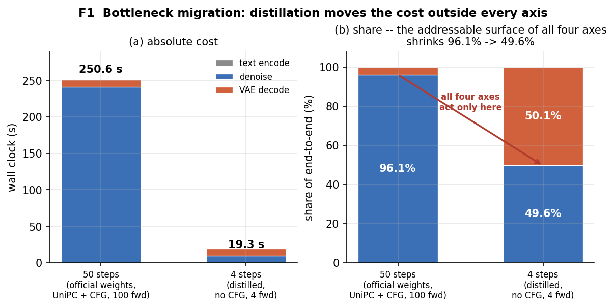
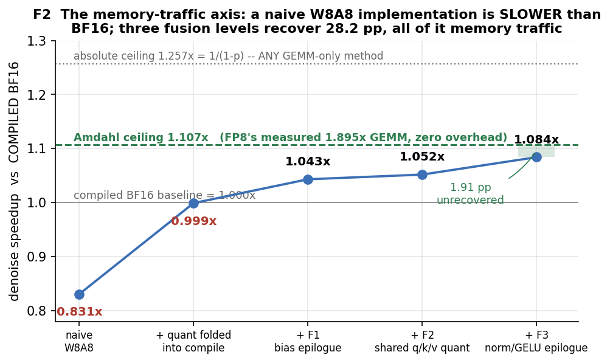
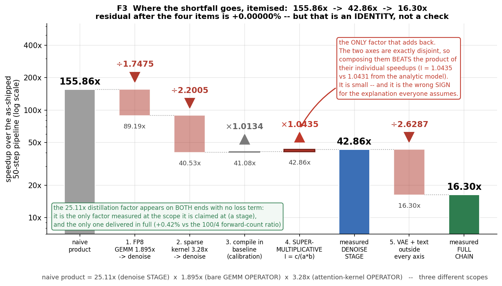
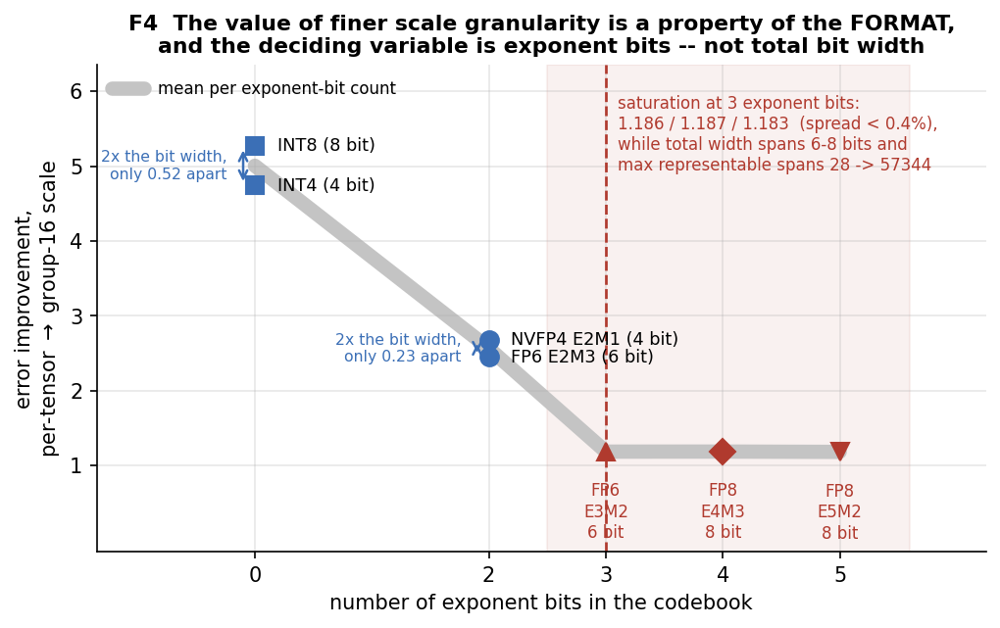

# 少步视频扩散模型的推理加速：四条轴的收益为什么不可加

> Wan2.1-T2V-1.3B（4 步蒸馏）· RTX 4090 · 2026-09
> 全部数字为本机实测，原始产物见 `results/`，复算脚本见 `benchmarks/`、`eval/`、`figures/`。
> 本文的自我更正**写在正文里**，不放附录 —— 索引见 §10.4。

---

## 摘要

我们在一个 4 步蒸馏的视频扩散模型（Wan2.1-T2V-1.3B，RTX 4090）上装齐四条推理加速轴
（步数蒸馏、FP8 W8A8、结构化稀疏 attention、算子融合），测量它们的收益为什么不能相乘。
三条轴头条加速比之积为 **155.86×**，全链路实测 **16.30×**，即 **10.5%**。
**差额的成因不是手段互相争抢 —— 该解释被否证**：FP8 与稀疏**精确不相交**且超乘复合，
交互比 **I = 1.0435**，与不相交解析模型预测的 **1.0431 相差 0.0004**（4 步与 50 步下均成立）。
真实成因有三：头条数字是**局部**加速比却被当全局读；**使能手段的开销不在头条数字里**；
以及安全阈值被**步数取整静默关闭**。叠加其上的结构性事实是，第一条轴成功之后，
最大的单项成本 **VAE decode 占 4 步端到端 50.1%**，落在所有四条轴的作用域之外。
质量侧我们指出一条更强的边界：当加速改变了**样本身份**，PSNR、高频能量比与无参照 IQA
都同时含「内容不同」；**而在结构化稀疏的失效模式上，无参照 IQA 不只是失效，是方向相反** ——
它给结构崩坏（肢体不连）的帧打出 **0.7617**，高于干净参照的 **0.7145**。
**四条机评指标里，三条说「不一样」，一条说「更好」，没有一条说「坏了」。**

---

## 1. 引言

### 1.1 一句话论点

**推理加速的收益不可加。我们先否证了最直觉的那个解释，再给出三个真实成因。**

文献里默认为真的图景是：若干条加速轴各自报一个加速比，叠起来会互相打架，
所以乘积拿不到。**我们实测的结果是那个解释错了。**

> **否证（实测）：手段之间不争抢。**
> FP8 量化与结构化稀疏在本实现下**精确不相交**，且**超乘性**复合：
> 交互比 `I = c/(a·b) = 1.0435`，与「完全不相交」解析模型的预测 **1.0431 相差 0.0004**；
> 在 4 步与 50 步下均成立（1.0435 / 1.0367）。详见 §7。
> **那个所有人都以为对的解释，在这里是假的。**

⚠️ **「不争抢」不能算作不可加的一个成因** —— 若两条轴不争抢，它对差额的贡献是**零**；
事实上超乘复合让差额**更小**。把它列为成因之一是范畴错误。
（本文中间稿正是这样写的：「四个成因……没有一个是争抢」，然后第一条成因就是「不争抢」。
自相矛盾。见 §10.4 第 13 条。）

**三个真实成因是：**

**(一) 头条数字是局部加速比，被当作全局加速比读。**
蒸馏的 **25.11×** 是一个**阶段**（denoise）的，FP8 的 **1.895×** 是一个**算子**（裸 GEMM）的，
稀疏的 **3.28×** 是另一个**算子**（attention kernel）的。三者相乘 **155.86×**，
而全链路实测只有 **16.30×（10.5%）**。
**把不同尺度上测得的局部加速比相乘，得到的不是任何东西的上界。**

**(二) 让手段能跑起来的开销，不在头条数字里。**
朴素 W8A8 实现比 BF16 **更慢**（0.831×），需要三级融合才回到 1.084×；
稀疏所需的 token 重排吃掉 **26%** 的 kernel 收益（4.13× → 3.28×）。
**这是轴内部的不可加**，也是别人复现时一定会撞上的那条 ——
文献报 3.28×，他跑出来 2.4×，差额就在这里。

**(三) 配置层面的不可加：安全阈值被步数取整静默关闭。**
SVG 把它的质量保险（首步 dense 预热）表达为**步数的一个分数**（`floor(0.2 × N)`）。
50 步下这是 10 步 dense；**4 步下 `floor(0.8) = 0`，保险被静默关闭，没有任何警告。**
后果不是渐进退化：PSNR 从 13.86 掉到 **8.26 dB**，构图完全改变。
→ **任何把安全阈值表达为「步数的一个分数」的加速方法，在少步设定下都会不连续地失效。**

**叠加在这三条之上的是一个结构性事实**：第一条轴成功之后，
最大的单项成本（VAE decode，占 4 步端到端 **50.1%**）落在所有轴的作用域之外。

### 1.2 (三) 与 (一) 是同一个病理的两个面

(一) 说的是**指标与轴的选择**继承了 50 步时代的假设：
本文的四条轴（步数 / 精度 / 稀疏 / 访存）**全部作用在 denoise 上**，
50 步时这个选择是对的（denoise 占端到端 96.1%），4 步时它只剩 49.6% 的可寻址面。

(三) 说的是**超参的表达方式**继承了同一个假设。

**前者让人高估收益，后者让人误判归因。** 任何人明天拿 SVG 的默认配置去测一个 4 步模型，
都会撞上 (三)，并把结论写成「SVG 在少步模型上摧毁质量」—— **那个归因是错的**。
**(三) 是三条里唯一一条读者可以立刻拿去用的**（那条否证的 I = 1.0435 优美但不可操作）。

⚠️ 我们**没有修** SVG 的这个默认值。不改第三方组件的默认配置是本项目的纪律；
我们测的是**它在本设定下意味着什么**。

### 1.3 这个论点的性质

它把「我们没拿到一个好看的 N×」从缺陷变成了结论。
四条轴全部装齐、全部实测之后，端到端加速为 **16.30×**（VAE fp32）或 **23.26×**（VAE bf16），
**对照组是今天实际在跑的那条 50 步流水线**（官方 Wan2.1-T2V-1.3B 权重、UniPC + 外部 CFG、
100 次前向、eager，总 250.63 s / 245.82 s），而朴素乘积是 155.86×。

**差额的每一部分我们都能指出它在哪里、属于三个成因中的哪一个** ——
§7.5 把 155.86 → 42.86 → 16.30 逐段拆开，那张瀑布表就是本文的核心图。

---

## 2. 相关工作、组件归属与测量口径

### 2.0 相关工作：本文的对照组与被测对象各是课程 starting point 一支的产物

课程给定的 starting point 是三篇：
**EDM**（Karras et al., 2206.00364）、**DPM-Solver**（Lu et al., 2206.00927）、
**Consistency Models**（Song et al., 2303.01469）。三篇都在**步数**这条轴上。

**它们与本文的关系不是主题相近，是血缘**：

> 本文的对照组（**UniPC 50 步**）与被测对象（**4 步蒸馏**）
> **分别是课程 starting point 两支的直系产物**：
> DPM-Solver 那条 **training-free** 的路（UniPC 是该系的统一预测-校正后继），
> 与 Consistency Models 那条 **training-based** 的路（lightx2v 的 DMD2 蒸馏是同族）。
> **本文瀑布里的 25.11×，就是这两支之间的距离。**
>
> 本文不在这条轴上再加工作 —— 它问的是**这条轴成功之后**：
> 当 denoise 从端到端的 96.1% 掉到 49.6%，其余加速轴还剩多少可寻址面（§3），
> 以及它们的收益为什么乘不起来（§7）。

⭐ 接上 §7.6：**瀑布里 25.11× 是唯一 100% 兑现、一分不损穿过的因子** ——
**即课程清单这条轴，是本文四条轴里唯一完全兑现的一条。**

#### EDM 与 §7 是同一个提问，回答方式不同

**EDM 的核心动作**是把扩散的设计空间**拆成可独立调节的模块**
（preconditioning / 噪声调度 / 采样器 / 训练分布），并用逐项累积的消融表展示
各模块的改进**可以叠加**。**本文在推理侧问的是同一个问题**：
四条加速轴是不是可独立调节的模块，收益能不能叠加。

| | EDM | 本文 |
|---|---|---|
| 模块性 | **按设计给定**（拆开就是为了独立调） | **当作待测命题**（`I = c/(a·b)`，判据预注册） |
| 结论 | 各模块改进可累积 | **延迟域：精确不相交**（I = 1.0435 vs 解析 1.0431）；**输出域：「不相交」没有定义**（§9.5.1） |
| 不可加的来源 | — | 不在手段之间，在**尺度、实现开销、配置**（三成因） |

> EDM 把「设计空间由可独立调节的模块构成」确立为扩散建模的方法论。
> **本文把同一个假设搬到推理加速侧，并且不预设它成立，而是去测它。**
> 结果是：在延迟域上它成立得出奇地好（差 0.0004），
> 而在输出域上它连定义都没有 —— **因为时间可加，而采样轨迹不可加。**

#### 本文接的两行，以及为什么这两行的测法都要改

加速类文献报告的核心是**两行数字：加速比 + 生成质量**。本文接的就是这两行：

| 那一行 | 通常怎么读 | 本文的修正 |
|---|---|---|
| **加速比** | 一个数 | 必须问**哪一级的加速比** —— 算子 / 阶段 / 全链路是三个不同的数，差 10 倍（§7.6） |
| **生成质量** | PSNR / 无参照 IQA 的一个均值 | 必须先问**样本身份是否保持**；身份改变后，一切「相对参照样本」的指标都同时含内容差异（§9.3–§9.5） |

#### 四条轴各自的代表工作

（详见 `research/RELATED_WORK.md`；本文**只当组件用**，不在任何一条上声称算法贡献。）

| 轴 | 代表工作 | 它报的数 | 本文的关系 |
|---|---|---|---|
| **步数** | 课程 starting point 三篇 → lightx2v 的 Wan2.1 4 步蒸馏（DMD2 自蒸馏） | 4 步可用 | **当 off-the-shelf 输入用**（§2.1），不自行蒸馏 |
| **稀疏** | **SVG**（2502.01776）：head 动态分 spatial / temporal + 定制 kernel | CogVideoX-v1.5 **2.28×**、HunyuanVideo **2.33×** 端到端 | **算法逐条用它的，只换 kernel 后端**（§2.2）；**不声称复现，不与其端到端数字直接比** |
| | Sparse-vDiT（AAAI 2026）：pattern 与 layer-depth / head-position 相关但**与输入内容关系有限** | 3–6% 的 head 可整跳 | 与 SVG 的动态 online profiling **存在张力**；本文测到跨步一致率 **75.6%**、不果断 **15.4%**（§6.2），**但未实现静态表** |
| **精度** | **SVDQuant / Nunchaku**（ICLR 2025）：低秩分支吸收 outlier | FLUX.1 在 4090 上对 NF4 W4A16 **3.0×**；5090 上 NVFP4 **3.1×** | 引作文献锚点；**它没做少步蒸馏模型，也没叠稀疏** |
| **访存** | epilogue 融合的通用做法 | — | 不声称融合本身有新意；报的是**它在这条轴上值多少**（§5.2 的 28.2 pp） |

**本文与它们的差别不在手段，在提问方式。**
它们各报一条轴的加速比；**本文把四条装齐，然后问为什么乘不起来。**
这个问题只有在链路装齐之后才能问 —— 这也是为什么本文必须做全套而不能只做一条。

⚠️ **一条自我约束**：`research/RELATED_WORK.md` 的开头写着
「sparse attention 的 pattern 设计是红海，不碰」「量化算法本身不重新发明」
「『我叠了 N 个技术』不是贡献」。
**本文的贡献必须是一个别人没问过的问题，而不是一次集成。**

### 2.1 模型与蒸馏权重

本文使用 lightx2v 公开发布的 4 步蒸馏模型 `Wan2.1-T2V-1.3B-Distill-Models`
（完整 BF16 权重，revision `ef72050`）。步数蒸馏属于训练侧优化，
本文研究的是推理侧加速链路，两者正交。将蒸馏结果作为给定输入，
可使量化、稀疏、融合三轴的评测基线与公开权重完全一致，
从而使本文结果可被第三方逐位复现 —— 这是自行蒸馏无法提供的性质。

**模型事实（读码与实测确认，非二手）**：
`seq_len = 32760`（21 latent 帧 × 30 × 52），30 层，`dim = 1536`，`ffn_dim = 8960`，
12 头 × 128；**FFN 是单分支 GELU(tanh)，不是 gated**；`text_len = 512`，`text_dim = 4096`。
4 步配置：timesteps `[1000, 750, 500, 250]`，`shift = 5`，**无 CFG**，1 forward/step。
50 步基线：UniPC + CFG = 100 forwards。

⚠️ **措辞纪律**：全文写「4 步蒸馏**模型**（完整权重）」，**不写「LoRA」** ——
实测 825 个 tensor、0 个 LoRA key、1.419 B 参数。

⚠️ **一处已作废的论证，保留以备追溯**：本文早期稿曾写「复现该蒸馏需要 14B 教师模型，
超出单卡显存」。**两处事实错误**：(a) 它不是 LoRA；(b) 教师不是 14B ——
该说法溯源自第三方仓库名，而 lightx2v 的 1.3B 线走 DMD2 双向步数蒸馏，
`real_score` 是原始 1.3B 基模自己。**且「做不到」这个论证本身站不住**，
前人已在单卡上把 DMD-QAD 训练搭通跑稳过。
换成可复现性论证之后，理由才是真的。**把二手信息升级成定稿，比写错更糟。**

### 2.2 SVG 的血统与命名

稀疏轴使用 SVG（Sparse VideoGen）的**算法**：两个 mask 的定义、`sample_mse` 的
head 分类准则、temporal 分支的 token 重排，**逐条用 SVG 原码**。
**只更换 kernel 后端**：flashinfer（本机未装）→ `torch.nn.attention.flex_attention`，
而后者是 **SVG 自己的第二个后端**（`sparse_flex_attention`），不是另找的实现。

报告中一律写
`SVG's mask design and head-classification criterion, with a FlexAttention backend`，
**不写「我们复现了 SVG」，不与 SVG 报告的端到端数字直接比较。**

### 2.3 测量口径 —— 以及一次让加速比虚高的基线错误

**⚠️ 自我更正（这条影响所有加速比数字，必须先讲）**：
本文的 FP8 加速比最初是拿**量化后的 compiled 实现**对**未 compile 的 BF16 eager 基线**比的。
`torch.compile` 单独作用在 BF16 上就有 **1.009×**，而 quant/dequant 路径从 compile 中
获益更多 —— **这个基线不公平，会让量化轴的收益里混进 compile 的收益。**
修正后全文的对照组统一为 **compiled BF16**，§4、§5 的所有数字都是在这个基线上重测的。

由此形成一条纪律，本文所有对比表都遵守：
**必须显式列出对照组的完整配置**（eager / compiled、SDPA backend、dtype）。

**为什么 backend 必须报**（同一个 dense attention，S = 32760、12 头 × 128）：

| SDPA backend | 耗时 | 若被它接管，稀疏加速比虚高 |
|---|---|---|
| flash（默认选中） | 40.45 ms | — |
| cudnn | 41.49 ms | +2.6% |
| **efficient** | **62.43 ms** | **+54%** |

**一个被 efficient 后端接管的 dense 基线，会让稀疏的加速比虚高 54%。**

**峰值算力的参照系**（这条也是一次更正，见 §9.5）：
4090 的标称 BF16 算力 165.2 TFLOPS 按 nominal boost clock 计算，
而本机**同 session 实测的 GEMM 上限是 171.4 TFLOPS = 标称的 103.7%**。
全文的「% of peak」一律指**同 session 实测上限**，不指标称值。

**环境**：RTX 4090（单卡可用 22.16 GiB），torch 2.11.0+cu128，CUDA 12.8。
E0 的关键结论在 torch 2.5.1+cu124 上逐位复现过。

---

## 3. 瓶颈迁移：第一条轴成功之后，剩下三条能碰的面缩掉一半

### 3.1 阶段级 profile


*图 F1：左 = 绝对耗时，右 = 占比。四条轴全部只作用于 denoise，
而 denoise 的占比从 96.1% 掉到 49.6%。*

| | 50 步（官方权重，UniPC + CFG） | 4 步（蒸馏权重，无 CFG） |
|---|---|---|
| text encode | — | 0.06 s |
| denoise | 240.8 s | **9.59 s** |
| VAE decode（fp32） | 9.69 s | 9.69 s |
| **端到端** | **250.63 s** | **19.34 s** |
| **denoise 占比（四条轴的全部可寻址面）** | **96.1%** | **49.6%** |
| **VAE decode 占比（不在任何一条轴上）** | 3.9% | **50.1%** |

**蒸馏轴的兑现是干净的**：denoise 段 **25.11×**，与前向次数比 100/4 = 25.0 相差 0.4%。
但端到端只有 **12.96×**（VAE fp32）/ **16.91×**（VAE bf16）。

### 3.2 最锋利的一句

> VAE decode 从 FP32 换成 BF16，使端到端 19.34 → 14.54 s = **1.33×**；
> 而整条量化轴做到理论极致，端到端上界是 **1.050×**。
> **一个界外组件的 dtype 改动，收益超过整条量化轴。**

（VAE 的 fp32 → bf16 是保真的：对真实 latent 的输出 PSNR **45.89 dB**，
p99 误差 4.99/255，max 55/255。1.98× 的加速。）

### 3.3 算子级 profile 与 Amdahl 上界

denoise 内部（compiled BF16，flash backend）：
**attention 52.5%、GEMM 20.4%**（eager 下为 51.7% / 20.2%，结构一致）。

**两个不同的上界，本文都会用到，必须分清**（`p` = GEMM 占 denoise 的比例 = 20.43%）：

| 上界 | 公式 | 值 | 它回答的问题 |
|---|---|---|---|
| **FP8 零开销上界** | `1/((1−p) + p/1.895)` | **1.107×** | 把 E0 实测的 1.895× GEMM **无损耗地**落进模型，最多能得多少 |
| **GEMM 无穷快上界** | `1/(1−p)` | **1.257×** | **任何**只加速 GEMM 的手段（含 NVFP4、INT4……）的绝对天花板 |

端到端上界（FP8 零开销）为 **1.050×**。
**「1.107×」是整条 FP8 精度轴的天花板** —— 在报任何 FP8 加速比之前，这个数先要摆出来。

⚠️ **自我更正**：本文中间稿把 1.107× 写成「GEMM 无穷快的上界」。**那是错的** ——
1.107 的公式里带着 `1.895`，它是**这个格式**的上界，不是**所有格式**的上界。
若照那个错误说法，「NVFP4 还有多少空间」的答案会是「几乎没有」（1.107 已被吃掉 97.9%）；
**正确答案是还有 1.257/1.107 = 13.5% 的格式侧空间**（§8.6 用这个数做 NVFP4 预估）。
**一个被叫错名字的界，会让下一个决策问错问题。**

⚠️ **通则**：profile 的占比必须与独立的 FLOPs 估算交叉验证。
本文的 attention 占比是与 `4·B·H·S²·D` 的解析 FLOPs 对过的。

---

## 4. 精度轴：FP8 W8A8

### 4.1 三数结构（对照组：**compiled BF16**，flash backend）

报一个量化加速比时，只给一个数是没有信息的。我们给三个：

| | 相对 compiled BF16 |
|---|---|
| **朴素 W8A8 实现** | **0.831×（比 BF16 慢）** |
| + 把 quant/dequant 折进 compile | 0.999× |
| + 三级融合（§5） | **1.084×** |
| **理论上界**（FP8 的 1.895× GEMM，零开销） | **1.107×** |
| *（参考：任何只加速 GEMM 的手段的绝对天花板 = `1/(1−p)`）* | *1.257×* |

**裸 GEMM 层面 FP8 相对 BF16 是 1.895×**（按 Wan 真实 GEMM 形状加权，torch 2.5.1 与
2.11 逐位复现）。**从 1.895× 到 1.084× 的落差，全部是 Amdahl 与访存，不是量化本身不行。**

权重显存 2.64 → **1.35 GiB**；denoise 峰值显存 **4.17 → 2.79 GiB（−33%）**
（对照组是 compiled BF16 的 4.17 GiB；eager BF16 为 4.27 GiB）。

⚠️ **关于 FP8 峰值的一处文献订正**：Ada 白皮书 v2.02 的 FP8 行写 660.6 TFLOPS，
v2.1 的脚注 4 将 FP32-accumulate 改正为 **330.3**，660.6 是 FP16-accumulate 行。
本文按 330.3 计。4090 在真实形状上达到同 session 上限的 **92–101%**
（对照：同一套脚本在 L4 上是 70–78%）。

### 4.2 GPTQ 与 scale 侧自由度

以「相对 RTN 的误差恢复率」衡量（300 个真实 Wan 权重张量）：

| 配置 | 恢复率 |
|---|---|
| GPTQ | 73.36% |
| **GPTQ + cd** | **78.15%** |
| GPTQ + clip + cd | 78.19% |

**最后那 +0.035pp 不值得要**：它让 225/300 层选了 γ < 1，
而像素 PSNR 反而**低 0.50 dB**。**一个在权重误差上更好的配置，在输出上更差。**
我们据此只保留 cd。

⭐ **而「clip 在 FP8 上无用」不是一个关于 FP8 的结论，是一个关于动态范围的结论** ——
§8.4.1 用同码本、同 Hessian、只改 scale 粒度测到：**NVFP4 @ per-channel 上 clip 给 +1.669 pp**，
而 NVFP4 @ group-16 上只有 +0.008 pp。
**clip 与细粒度 scale 是同一件事的两种做法，谁先做谁吃掉另一个的收益。**

⚠️ **顺带一个读表的陷阱**：FP8 上 **225/300 层选了 γ<1**，看起来「clip 被大量采用」，
而收益只有 0.035pp。**目标函数在 γ≈1 附近是平的，argmin 就往下飘。**
**「γ 被选中」≠「γ 有用」—— 只看 γ 直方图会把「平」误读成「有效」。**

**per-token 激活量化对质量没有帮助**（见 §9.1 的 VBench 与 PSNR 两列）：
sm_89 的 `_scaled_mm` 原生只支持 per-tensor，而放宽到 per-token 并没有换来可测的改善。

### 4.3 ⚠️ 自我更正：伪量化路径与真 kernel 的一致性，我最初期待错了对象

为把格式层面的结论（§8）与 kernel 实现解耦，我们建了一条伪量化路径并要求它与真 kernel 对齐。

**对齐做到了，但对齐的是正确的那一边**：
伪量化对 FP64 参照的误差是 **1e-6**，而 4090 的 `_scaled_mm` 偏离 FP64 参照
**2.5e-3 ~ 3.3e-3`** —— **伪量化是更忠实的格式模型，真 kernel 才是偏离的那个。**

过程中发现两个 bug，第二个是主导：
- **bug2**：用 `bucketize` 找最近电平，与硬件 cast 的舍入规则不同，
  最多 **3.99%** 的元素落在不同电平上，对端到端 latent 偏离的贡献达 **34.6pp**
- bug1：中间结果在 bf16 上往返，贡献 0.7–4.7pp

**端到端始终闭不上，而且不应该期待它闭上**：同配置重跑差 **0.0000**（流水线逐位确定），
但**两个数学等价的真 kernel 配置**之间差 **0.1204**。
→ **裁定：伪量化在格式层面有效，在 kernel 输出预测上无效。
可支撑性的下限是 latent 相对 L2 = 0.12。** §8 的格式结论建立在这个裁定之上。

### 4.4 ⭐⭐ 量化算法本身：GPTQ 及其两处改进（原理）

> 前面三节报的是**数字**，这一节讲**数字底下的算法** ——
> §4.2 只有结果，没有机制，这一节补上。

#### 4.4.1 任何「码本 + scale」格式都只有两个自由度

**这一节讲的结构对本文用到的所有格式都成立**（FP8 E4M3、NVFP4 E2M1、INT4……）：
一层权重能调的自由度**只有两个** ——
1. 每组共享的那个 **scale**；
2. 每个权重最终 snap 到哪一个 **码字**。

**以 NVFP4 为例最直观，因为它的码字少到看得见。** NVFP4 是 4-bit 浮点，
每个数用 **E2M1**（2 位指数、1 位尾数、1 位符号），一层里只有 **16 个固定码字**，
再配一个 **block-16** 粒度的微 scale。码字**不是均匀分布**的，靠近 0 密、往外越来越疏：
**±{0, 0.5, 1, 1.5, 2, 3, 4, 6}**，absmax = **6**。

量化一个 block 时，scale 通常取 `scale = absmax / 6` ——
把块内绝对值最大的那个元素正好映射到码字 6（保证不溢出），其余的数除以 scale 后就近 snap。

**FP8 E4M3 是同一个结构**，只是码字有 256 个、absmax 是 448、scale 通常是 per-tensor。
**这两处差别（码字的动态范围、scale 的粒度）后面会变成 §8.4.1 的两个自变量。**

**RTN（round-to-nearest）只认真定了 scale**，码字让每个权重各自就近取整 ——
**「每个权重舍到哪个格点」这个自由度完全没被利用。**

于是有两条数据感知的优化线，各占一侧：**权重侧的 GPTQ**（本文用了，且本节主讲），
**激活侧的一类残差分解方法**（本文未用，见 §4.4.7）。

→ **本文对 NVFP4 的实测在 §8.4.1（clip 的机制）与 §8.6（码本的算法质量）。**

#### 4.4.2 GPTQ 优化的不是权重误差，而是层输出误差

RTN 隐含的目标是让权重本身尽量准：`min ‖W − Ŵ‖²`。
**GPTQ 换了目标**：让**这一层的输出**尽量准：

```
min ‖ W X − Ŵ X ‖²        X 是这一层的输入激活
```

**这个差别是整个方法的关键。** 一个权重错了多少本身不重要；
重要的是它错的这一点会被乘上什么样的输入 ——
乘在高能量、经常被激活的通道上，输出就偏得厉害；乘在几乎不激活的通道上，错了也几乎无害。

**RTN 对所有权重一视同仁；GPTQ 通过输入的统计给不同权重的误差「定不同的价」。**

#### 4.4.3 从「输出误差」到「逐列量化 + 残差补偿」

把目标展开，起决定作用的是输入激活的**二阶矩（Hessian）**：

```
H = (1/N) Σ x xᵀ
```

它描述输入通道之间怎么相关（可理解成通道的协方差）。

**H 怎么来**：需要一个**校准集** —— 一批 prompt + 噪声，跑真实的去噪 rollout，
对每一层把该层每次被调用时的输入激活 `x` 截下来累积。
校准集不用大（LLM 上通常 128 条；在本模型这一类设定下，此前的观察是 128 prompt 已饱和 ——
**本文用 16 条，未复跑饱和曲线**）。

⚠️ **一个容易搞混的点**：H 累积的是 `x` 的**外积** `xxᵀ`（二阶矩），
**不是把 `x` 本身取平均**。取平均会丢掉通道之间的相关结构，
而 GPTQ 要的恰恰是这个结构 —— **逆 Hessian 正是靠它决定「误差该往哪些相关通道上推」**。
式中的 `1/N` 均的是矩阵不是向量，只影响整体缩放、不改变 `H⁻¹` 的方向结构，
且前馈补偿时会上下约掉，不影响结果。

这个目标对每个输出行独立可分，且所有行共享同一个 H。
于是可以**一次量化一列**。量化掉第 `q` 列、产生舍入误差后，
把误差**前馈补偿给还没量化的列**：

```
δ(剩余列) = − (w_q − ŵ_q) / [H⁻¹]_qq  ·  H⁻¹[:, q]
```

直觉：H 告诉你通道之间怎么相关，`H⁻¹` 告诉你「要抵消这一列的误差，
该往相关的邻居列上各推多少」；分母 `[H⁻¹]_qq` 是归一化。

流程：① 量化第 1 列 → ② 把舍入误差前馈给后面所有未量化的列 →
③ 轮到第 2 列时它已被「预调整」过，snap 到的是考虑了前面误差之后的最优码字 →
④ 一路滚到最后一列。

**⚠️ 整个过程里，16 个码字一个都没变。** 变的只是每个权重最终落到哪个码字上 ——
而这个选择是被**联合、加权地**优化出来的，不再是各自就近取整。

#### 4.4.4 一个好用的类比：误差扩散抖动

图像处理里的 **Floyd–Steinberg 误差扩散抖动**：逐像素量化，
把每个像素的舍入残差扩散给周围还没处理的邻近像素，
于是保住了局部平均亮度，把误差变成人眼不敏感的高频噪点。

**GPTQ 是同一个家族（误差反馈量化）**，一一对应：

| | Floyd–Steinberg 抖动 | GPTQ |
|---|---|---|
| 量化对象 | 像素 | 权重 |
| 残差去向 | 前馈给未处理的邻近像素 | 前馈给未量化的权重列 |
| **扩散核** | 固定的手工核 `(7,3,5,1)/16` | **从数据统计里学出的逆 Hessian `H⁻¹`** |
| 保住的量 | 局部平均亮度 | 层的输出 |

> **一句话：GPTQ 就是把误差扩散抖动搬到权重上，扩散核从固定手工核换成了从数据统计学出来的逆 Hessian。**

#### 4.4.5 搬到 DiT / 视频扩散：内核不动，适配全在外围

GPTQ 最早用在 LLM 上。搬到 DiT，**它的内核一行都不用改** ——
它逐线性层工作，不在乎这一层来自语言模型还是扩散模型，架构差异对它透明。

要适配的都在外围，也就是**怎么给它喂 H**：

1. **H 采自真实的多步去噪过程**（on-policy rollout），而不是随便一批数据 ——
   扩散是多步生成，H 要反映真实推理时的激活分布。
2. **因为是 W4A4，激活也要量化**，所以算 H 之前**激活先过一遍 fake-quant** 再统计，
   让 H 反映量化后的真实输入。
3. **自洽迭代**（见下）。

⚠️ **一条 NVFP4 特有的硬约束**：LLM 那边常用的 **act-order**（按重要性重排输入通道）
**在这里不能用** —— 它会破坏 NVFP4 的 **block-16 块对齐**。

**自洽迭代（容易理解错，专门说清）**：量化之后激活分布变了，
所以第一轮算 H 用的输入是「量化前的分布」，略有偏差。
自洽迭代拿量化后的模型重新跑一遍、采一个更贴近真实的 H，然后 ——
**关键 —— 从原始的 bf16 权重出发，用这个新 H 重新完整量化一次。**

> **每一轮都是从原始权重重新量化，变的只有 H；
> 绝不是在上一轮的量化结果上再叠一层量化。** 跑一两轮就收敛。

⚠️ **本文的 NVFP4 臂没有做自洽迭代，且 H 取自 FP8 激活** —— 见 §8.6.5 第 1 条。

#### 4.4.6 两处改进：clip（scale 侧）与 cd（码字侧）

出发点：**GPTQ 是一个贪心求解器，并不是它自己那个目标函数的最优解。**
既然如此，把求解器磨得更好一点，应该还能再挤出一些收益。
NVFP4 一层权重就那两个自由度，下面两招**各松一个**。

**clip（scale 侧，轻裁剪）** —— 默认 `scale = absmax/6` 隐含一个假设：
「这个 block 里最大的那个元素必须无损」。代价是**为了照顾这一个最大值，
其余 15 个元素的格距被撑粗了**。clip 引入裁剪系数 γ：

```
scale = γ · absmax / 6,      γ ∈ {1.0, 0.97, 0.94, 0.90}（每层按误差选优）
```

即**让最大值轻微削顶，换来大多数元素的格距细一点** —— 1 个元素亏、15 个元素赚。

⭐ **一个关键的互补性**：这一招**单独配 RTN 是不赚的**（削顶纯是净损失，实测原地踏步）；
**必须配 GPTQ 才赚** —— 因为 GPTQ 的误差反馈机制会把削顶造成的损失甩给后面的列去补偿，
而细格距带来的收益被留了下来。**是「裁剪」和「误差反馈」两件事叠在一起才产生正收益。**

⚠️ **但「赚不赚」还取决于格式与粒度，本文对此做了实测并更正了原先的推广** —— 见 §8.4.1。

**cd（码字侧，坐标下降抛光）** —— GPTQ 解完之后再扫几遍：
逐个元素，固定其余所有权重，单独把这一个权重在 16 个格点里重新选到最优位置。
固定其余变量时目标对这单个变量是**二次的**，可闭式算出最优，
且只接受让 loss 下降的改动（**严格单调**）。

**从算法层面收口**：这个问题本质是**离散二次规划，NP-hard**。
在这个视角下，几种方法是**逐级变强的局部最优**：

| 方法 | 局部最优深度 |
|---|---|
| **RTN** | 完全不协同（每个权重各自取整，谁也不管谁） |
| **GPTQ（贪心）** | 一次定一列、定完不回头 —— **连「改任何单个元素都无益」都不满足** |
| **GPTQ + 坐标下降** | 爬到 **1-opt 局部最优** |

**k-opt** 是组合优化里描述「局部最优深度」的说法，含义是「同时改动 k 个变量都无法再降低目标」：
- **1-opt**：任意**单独**改一个权重的码字都不能让 loss 更低（坐标下降扫到收敛就到这）
- **2-opt**：任意**同时**改**两个**权重的码字组合也不能再降。它比 1-opt 强，
  因为可能存在「单动任一个都变差、但两个一起动反而更好」的情况 —— 1-opt 会卡在那儿出不来

**实测在 1-opt 之上再上 2-opt 基本没有额外收益**，说明这个问题在 1-opt 就已经是很强的吸引子，
**求解器侧没什么好挤的了**。（且 2-opt 要搜索变量对，组合数太多、代价高得多，收益已饱和，不划算。）

#### 4.4.7 本文用了哪些、没用哪些

| 方法 | 本文 | 结果 |
|---|---|---|
| GPTQ | ✅ | 恢复率 73.36%（FP8）/ 72.00%（NVFP4 b16） |
| **+ cd** | ✅ **采用** | → **78.15%（FP8）/ 76.88%（NVFP4 b16）**，是真正起作用的那一半 |
| + clip | ❌ **不采用** | FP8 上 +0.035pp 且像素 PSNR **−0.50 dB**；NVFP4 b16 上 +0.008pp。**但在 per-channel 上 +1.669pp** —— 机制见 §8.4.1 |
| 2-opt | ❌ 未做 | 此前的实验观察是 1-opt 之上无额外收益，**本文未复跑** |
| 自洽迭代 | ❌ 未做 | 本文 NVFP4 臂的一处已知局限（§8.6.5） |
| **激活侧的残差分解**（一类近期方法） | ❌ **不在本文范围** | 核心思想是「抽出一个大的公共基准用高精度存，只量化小残差」：把激活按空间分块、每块的均值用 FP8 存（数量只有 1/64），**只把残差量化到 FP4**。因为量化误差近似正比于被量化张量的范数，压小范数就压小了绝对误差。**与 GPTQ 家族正交、可叠加**，但需要定制融合 kernel，且求均值本身是 memory-bound 的带宽开销。本文的精度轴止步于权重侧 |

⭐ **关于两条线先后次序的一个判断，值得记下来（本文未实测，作为设计经验）**：
权重的量化误差在多步去噪中是**同方向累积**的，是误差里最大的一块，
所以要**先**用 GPTQ 家族把它吃掉；等权重侧解干净之后，
每一层剩下的误差才**变成激活主导**，这时激活侧的杠杆才有兑现的空间。
→ **两者不是二选一的竞争，是有先后的接力：先权重、后激活。**
**顺序反了，激活那一招使不上劲** —— 这也解释了为什么
「某个方法单独用显得弱」与「叠加起来有效」并不矛盾。


---

## 5. 访存轴：三级融合，以及 28 个百分点去了哪里

### 5.1 折线（对照组：**compiled BF16**）


*图 F2：朴素 W8A8 在基线线以下（0.831×）。对照组画在图上（通则 5）。*

| 阶段 | denoise 加速 | 做了什么 |
|---|---|---|
| 朴素 W8A8 | 0.831× | 逐层 quant → `_scaled_mm` → dequant |
| + compiled quant | 0.999× | quant/dequant 折进 compile |
| **F1** | 1.043× | bias 进 `_scaled_mm` 的 epilogue |
| **F2** | 1.052× | q/k/v 共享一次量化（**逐位无改动**） |
| **F3** | **1.084×** | norm + modulation / GELU 融进 epilogue |
| 上界 | 1.107× | — |

**剩余 1.90%。轴关闭。**

### 5.2 28.2 个百分点，全部在访存

上表四级融合逐级回收的 denoise 时间（以 **compiled BF16 基线的单次前向耗时为分母**）：

| 档 | 回收 |
|---|---|
| + quant 折进 compile | **+20.31 pp** |
| + F1 bias 进 epilogue | +4.23 pp |
| + F2 q/k/v 共享量化 | +0.79 pp |
| + F3 norm/GELU 融合 | +2.83 pp |
| **四级合计** | **+28.16 pp** |
| 剩余到 Amdahl 上界 | 1.91 pp |
| 从朴素 W8A8 到上界的全部距离 | 30.07 pp |

**这 28.2 个百分点里没有一个来自更好的数值方法 —— 全部在访存。**
同一批 GEMM、同一批数值结果（F2 逐位无改动），差别只在数据被搬了几次。

⚠️ **对照组说明**：另有 0.9 pp 的访存优化在 BF16 基线上同样可得
（`torch.compile` 对 BF16 的 1.009×），**已计入基线，不算在这 28.2 pp 里**。

⚠️ **自我更正（本文最后一轮才发现）**：本项目中间稿把这个数写成 **27.9 pp**。
**27.9 是用 eager 基线的耗时作分母算的，而主表和「剩余 1.90%」用的是 compiled 分母。**
两个分母混在一段话里 —— 这正是 §2.3 那条纪律要防的事，而我在**自己修正过基线之后
仍然留下了旧分母的头条数字**。统一到 compiled 分母后是 **28.16 pp**（eager 分母下为
27.91 pp，且那时「剩余」是 0.94 pp 而不是 1.91 pp）。
**一次只改了一半的修正，比不改更难被发现。**

### 5.3 这一节是成因 (二) 的完整实例

一条轴的头条数字是 1.895×（裸 GEMM）。
实际把它接进模型，第一版是 **0.831×，比什么都不做还慢**。
**从「更慢」到「1.084×」的全部工作，都不在那个头条数字里。**

---

## 6. 稀疏轴：SVG 的 mask，FlexAttention 的后端

### 6.1 加速比（对照组：dense SDPA，**flash** backend，S = 32760）

| 项 | 值 |
|---|---|
| mask 稀疏率（保留元素） | **21.74%** → 理想 kernel 加速 4.60× |
| dense SDPA | **40.03 ms** |
| 稀疏 kernel（纯 mask） | 9.69 ms → **4.13×**（理想值的 **90%**） |
| + temporal 分支的 token 重排（一半 head） | 12.22 ms → **3.28×**（重排本身 2.53 ms） |
| **重排吃掉的 kernel 收益** | **26%** |
| online 分类 `sample_mse` | 1.9 ms/层/步 = 所使能稀疏 attention 的 **19.8%**。⚠️ **这一项不在 3.28× 里** |
| denoise | **1.489×**（对照组 = **compiled BF16 + flash**，与 §7.2 阶梯同一组测量） |
| 端到端（VAE fp32 / bf16） | 1.199× / 1.284×（同一对照组） |

**健全性检查**：dense 那一边没有被浪费 —— 它跑到了同 session GEMM 上限的 **95.4%**，
差的 4.6% 是 softmax 与在线 rescale。**4.13× 不是拿一个慢基线比出来的。**
（正确性也查过：对 FP64 参照的相对 L2 是 2.2e-3，即 bf16 本身的精度 —— SDPA 在算
完整的非因果 attention，没有偷工。）

⚠️ **两处 dense 耗时不要混用**：本表的 40.03 ms 来自 E4 自己的计时；
§2.3 那张 backend 对照表里的 40.45 ms 来自一次独立的口径审计（更长 warmup、
三种计时器交叉验证）。**两者相差 1%，但它们是两次不同协议下的测量，
加速比只能在同一次测量内部算。**

### 6.2 head 分类（自测，不引用文献数字）

4 步 × 5 层 × 12 head：**spatial 54.6% / temporal 45.4%**（两者相加 = 100%，二选一）。
**另有 15.4% 是「不果断」—— 这是叠在其上的 overlay，不是第三类**
（SVG 出厂代码只有两类，`assert len(attention_masks) == 2`；
「不果断」是我们操作化出来的：两个 mask 的 MSE 相差 < 10%）。
**不要与 HunyuanVideo 的 29.2 / 66.7 相比** —— 我们的分布与之差别很大。

相邻步的分类一致率 **75.6%**。
**这两个数一起才是完整的起点**：用静态表替代 online 分类的风险**不只是**
「跨步错分四分之一」，**还有**「六分之一的 head-step 本来就分不出来」。

### 6.3 ⭐ 成因 (三)：`floor(0.2 × N) = 0`

SVG 官方的 Wan 脚本用 `first_times_fp = 0.2`，
`num_fp_timesteps = floor(0.2 × num_inference_steps)`（`wan_t2v_inference.py:88`）：

| 步数 | `floor(0.2 × N)` | 占步数预算 |
|---|---|---|
| 50 步 | **10 步 dense** | 20% |
| **4 步** | **0 步 dense** | **0%** |

**同一个比例在 4 步下给出零预热。我们跑的就是 SVG 自己的配置。**

后果（§9.2 给出完整质量表）：PSNR **8.26 dB**、构图完全改变。
把第一步恢复为 dense：PSNR → **13.86 dB（+5.6 dB）**，构图回到与 BF16 一致 ——
但这一步是 **25% 的步数预算**，且把稀疏的 denoise 加速从 1.489× 拉到约 1.325×（**−11%**）。

**在 50 步下，同样的比例是免费的（20% 的预算买 10 步 dense）；在 4 步下不是。**

### 6.4 ⚠️ 自我更正：一次对第三方组件的性能指控，没有证据

稀疏臂的峰值显存是 **20.31 GiB**（dense 臂 4.79 GiB），在 22.16 GiB 的卡上已近上限。
我最初把它写成「FlexAttention 后端的代价，SVG 的 flashinfer 后端应该更省」。
**那句话没有任何测量支撑，而且是错的。**

判据只花 5 分钟：块稀疏的显存应当是 O(S)，若实测 O(S²) 则说明 score 矩阵被物化了。

| S | dense | 稀疏 | 增量 | 占完整 `[H,S,S]` score 矩阵 |
|---|---|---|---|---|
| 7 800 | 0.09 GiB | 0.11 GiB | 0.02 GiB | 1.7% |
| 32 760 | 0.38 GiB | 0.47 GiB | **0.10 GiB** | **0.4%** |

拟合 `delta ~ S^α` 得 **α = 1.005 → 确实是块稀疏，score 矩阵没有被物化。**
逐段隔离（S = 32760 单次调用峰值）：裸 FlexAttention 0.99 GiB、temporal 的 clone/permute
1.36 GiB、`sample_mse` 1.05 GiB、两个 dense mask 常驻 0.61 GiB —— **没有一段是 15 GiB。**

→ **正确归因**：20.31 GiB 是**我们接入层的瞬时分配在 30 层 × 4 步上累积**
（temporal head 的拷贝 + online 分类的 masked score 副本），
**不是 FlexAttention 的固有代价**。它与吃掉 26% kernel 收益的**是同一段代码**。

**教训**：我当时手上唯一的数据是「峰值 20.31 GiB」，
**从一个数字跳到一个因果归因，中间没有任何测量** —— 而方向还是把责任推给第三方组件。
对照组的配置要检查，**被自己批评的那个对象的配置同样要检查**。

---

## 7. ⭐ 不可加性归因（核心）

### 7.1 预注册判据

`I = c / (a·b)`，在 **denoise 段**上计算。判据写在测量之前（`e5_ladder.py` 的
`preregistered_criterion`）：`I ≥ 0.95` 判可乘，`I ≤ 0.90` 判争收益，中间不下结论。

**为什么用 denoise 不用端到端**：两条轴都只作用于 denoise；端到端还叠着 VAE 这个固定成本，
会把 I **机械地**推向 1（Amdahl 的算术效应），制造一个假的「可乘」判定。

### 7.2 2×2 阶梯（每个 arm **独立进程**，对照组 = compiled BF16 + flash）

| arm | denoise（4 步） | 峰值显存 |
|---|---|---|
| bf16_dense | 9.465 s | 4.79 GiB |
| fp8_dense（F3 全融合） | 8.728 s | 3.41 GiB |
| bf16_sparse | 6.358 s | 20.31 GiB |
| fp8_sparse | 5.619 s | 18.96 GiB |

| | 4 步 | 50 步 |
|---|---|---|
| a（只开 FP8） | 1.0845× | 1.0891× |
| b（只开稀疏） | 1.4887× | 1.5007× |
| a·b | 1.6144× | 1.6344× |
| **c（两者同开）** | **1.6846×** | **1.6943×** |
| **I** | **1.0435** | **1.0367** |
| 判定 | multiplicative | multiplicative |

### 7.3 I > 1 不是异常，是「不相交」的签名

两条优化若作用在**不相交**的时间分数 p、q 上（局部加速 s_p、s_q，记 A = p/s_p、B = q/s_q）：

```
1/a = (1−p) + A        1/b = (1−q) + B        1/c = (1−p−q) + A + B
(1/a)(1/b) − 1/c = (p − A)(q − B) ≥ 0        ⟹        c ≥ a·b 恒成立
```

用实测占比（GEMM 20.4%、attention 52.5%）反解出局部加速 1.616× / 2.670×，
代入完全不相交模型：

| | 4 步 | 50 步 |
|---|---|---|
| 预测 I（完全不相交） | **1.0431** | 1.0467 |
| 实测 I | **1.0435** | 1.0367 |
| **差** | **+0.0004** | −0.0100 |

→ **在本实现下，FP8 量化与结构化稀疏精确不相交。**

⚠️ 50 步的偏离 −0.0100 大于 4 步：模型用的占比取自 **4 步** 的 profile，
而 50 步带外部 CFG，占比会微移。不影响判定，但必须写明模型用的是哪一组占比。

**机制**：FP8 W8A8 量化的是 **linear 层**（q/k/v/o 投影与 FFN），
稀疏作用于 **attention 算子本身**（`Q@Kᵀ` 与 `P@V` 仍是 BF16）。
原假设「两者争 attention 的同一份收益」—— **那个前提本身就不对**。
（若把 attention 也量化成 FP8，它才重新变成一个真问题。）

### 7.4 ⚠️「超乘」必须防误读

I > 1 写成「超乘」，读者第一反应是协同增效。**不是。**

> **超乘不是协同增效。** FP8 加速 GEMM 之后，GEMM 在 denoise 中的占比下降，
> **attention 的占比相应上升**，于是稀疏化 attention 在这个新基线上的相对收益
> 比在原基线上更大。**这是 Amdahl 的算术效应，不是两种手段产生了额外增益。**
> 解析上 `(1/a)(1/b) − 1/c = (p−A)(q−B) ≥ 0` 对**任意**不相交的两项优化恒成立，
> 与手段是什么无关。

### 7.5 朴素乘积 vs 实际

| 因子 | 值 | 尺度 |
|---|---|---|
| 步数蒸馏 | 25.11× | 一个**阶段**（denoise） |
| FP8 | 1.895× | 一个**算子**（裸 GEMM） |
| 稀疏 | 3.28× | 另一个**算子**（attention kernel） |
| **朴素乘积** | **155.86×** | — |
| **实测端到端**（VAE fp32 / bf16） | **16.30× / 23.26×** | 全链路 |
| **兑现率** | **10.5% / 14.9%** | — |

**三个因子全部是本机实测，不是从文献抄的。**
这张表是成因 (一) 的全部内容：三个数没有一个是错的，错的是把它们相乘。

**全链路那两个数的算式**（`benchmarks/e5_fullchain.py` → `results/E5/fullchain.json`，
text 与 VAE 与配置无关，denoise 取 §7.2 阶梯的实测值）：

| VAE dtype | 50 步基线 | 4 步 + FP8 + 稀疏 | 全链路 |
|---|---|---|---|
| fp32 | 250.63 s | 0.059 + 5.619 + 9.694 = **15.37 s** | **16.30×** |
| bf16 | 245.82 s | 0.059 + 5.619 + 4.889 = **10.57 s** | **23.26×** |

⚠️ **VAE dtype 必须成对**：50 步基线与 4 步配置要用同一个 VAE dtype，
否则会把 VAE 自己的 1.98× 混进链路加速比里。

⚠️ **对照组（50 步基线）也有两个候选，必须说明选了哪个**：

| 候选 | denoise | 是什么 |
|---|---|---|
| **主用** | **240.82 s** | **官方 Wan2.1-T2V-1.3B 权重**、UniPC + 外部 CFG、**eager** —— 今天用户实际跑的那条流水线 |
| 敏感性参照 | 238.84 s | **蒸馏权重**跑 50 步、compiled（§7.2 阶梯的 50 步臂） |

**选主用那个**：全链路要回答「不做蒸馏时这条流水线要多久」，
而阶梯的 50 步臂用的是**蒸馏后的权重**，拿它当分母会抹掉一部分蒸馏收益。
两者差 0.8%（100 次前向的耗时几乎不依赖权重内容），
**若把基线也 compile，全链路从 16.30× 变为 16.18×** —— 不改变任何结论。

⚠️ **自我更正**：本项目中间稿流传过 **16.48× / 23.63×**，**从落盘数字复算不出来** ——
它们出现时没有记录组合方式。正确值是 16.30× / 23.26×。
**一个没有算式、只有结论的承重数字，是下一次错误的入口** ——
所以这一步现在是一个脚本，不是一句话。

### 7.6 ⭐⭐ 差额到底在哪里：逐项拆开，残差为零

§1.3 承诺「差额的每一部分我们都能指出它在哪里」。这一节兑现它。
**全部是已有落盘数字的算术，没有新测量**（`results/E5/fullchain.json` 的 `waterfall`）。


*图 F3（主图）：纵轴对数。**第 4 项是唯一一根向上的柱子 —— 那就是 §1.1 的那条否证。***

| # | 项 | 因子 | 累积 | 归因 |
|---|---|---|---|---|
| — | **朴素乘积** | — | **155.86×** | 25.11（阶段）× 1.895（算子）× 3.28（算子） |
| 1 | FP8：裸 GEMM 1.895× → denoise 1.0845× | **÷1.7475** | 89.19× | 成因 (二) 实现开销 + 成因 (一) 作用域 |
| 2 | 稀疏：mask kernel 3.276× → denoise 1.4887× | **÷2.2005** | 40.53× | 成因 (一) 作用域 **+ 成因 (二) online 分类（÷1.1570）**，见下 |
| 3 | `torch.compile` 已含在 BF16 基线里 | **×1.0134** | 41.08× | **不属三成因，是口径项**（见下） |
| 4 | **超乘 I = c/(a·b)** | **×1.0435** | **42.86×** | **⭐ 那条否证 —— 唯一一个往回加的因子** |
| — | **denoise 段实测** | — | **42.86×** | **残差 +0.00000%** |
| 5 | VAE decode + text encode 在所有轴的作用域之外 | **÷2.6287** | **16.30×** | 结构性事实 |

**第 3 项是什么**：朴素乘积里的蒸馏因子是对 **eager** 的 4 步 denoise（9.592 s）测的，
而阶梯的四个臂是 **compiled**（bf16_dense 9.465 s）。
这 1.34% 是两次测量的基线差，**不是一个加速来源**，按通则 5 单列而不混进成因里。

### ⚠️ 残差为零是恒等式，不是检验通过

**必须写明，否则这张表会被当成一次验证。**
`42.86 = 240.82 / 5.619` 可以电报式地拆成

```
240.82/5.619 = (240.82/9.592) × (9.592/9.465) × (9.465/5.619)
             =       D        ×    compile    ×        c
```

而 `c = a·b·I` **按 I 的定义**恒成立。
→ **无论把每一项叫成什么、归给哪个成因，残差都是零。**
**闭合不构成正确性的证据；这张表的内容在于每一项的归因，不在于它闭合。**
（这与 §7.7 是同一类问题：先想清楚读出量在零假设下取什么值 —— 这里恒为 0。）

### ⚠️ 第 2 项的归因不纯：里面有一段是成因 (二)，而且是它最字面的形态

第 1 项已经诚实地写成「成因 (二) + 成因 (一)」的打包，**第 2 项却写成了纯作用域 ——
这个不对称本身就可疑，而它确实不纯。**

把 online 分类（`sample_mse`，1.919 ms/层/步）算进去：

| 量 | 值 | 说明 |
|---|---|---|
| 头条 kernel 加速（§6.1） | **3.2759×** | `40.033 / 12.220`，**不含 online 分类** |
| 含 online 分类 | **2.8312×** | `40.033 / (12.220 + 1.919)` |
| 从实测 b 与 52.5% 占比反解的 attention 局部加速（§7.3） | **2.6697×** | — |

于是 `3.2759 → 2.6697` 这段落差（÷1.2270）可以拆开：

| 段 | 因子 | 归属 |
|---|---|---|
| 3.2759 → 2.8312（online 分类） | **÷1.1570** | **成因 (二)** —— 使能开销，**且完全不在头条数字里** |
| 2.8312 → 2.6697（残余） | ÷1.0605 | wrapper 的瞬时分配（§6.4 说它与吃掉 26% 的是同一段代码）/ 占比估计精度 |

⭐ **而这一段是成因 (二) 最纯粹的形态**：token 重排那 26% 至少**在头条数字的推导里可见**
（4.13× → 3.28× 明写在 §6.1 的表里）；**online 分类连这个都不是 —— 它在 3.28× 之外，
任何只读 SVG 头条加速比的人都不会知道它存在。**
成因 (二) 的原话是「让手段能跑起来的开销，不在头条数字里」。
**这是全文对这句话最字面的一个实例。**

### ⭐ 一个**真的**检验：Amdahl 正推（与上面那个恒等式对照着读）

上面刚说完「残差为零是恒等式，不是检验」。**那什么才算检验？** 这个：

```
b_pred = 1 / ( (1 − 0.5249) + 0.5249 / 2.8312 ) = 1.5140
b_meas = 1.4887                                 →  偏差 +1.70%
```

**这个 1.70% 不是被定义出来的。** 它由**三个独立测量**共同决定 ——
dense attention 40.033 ms、稀疏含分类 12.220 + 1.919 = **14.139 ms**、attention 占 denoise 52.5% ——
**完全可以差 20%。** 差 1.70% 是一次真实的一致性确认。

| | 残差 +0.00000%（§7.6 上文） | Amdahl 正推 +1.70%（此处） |
|---|---|---|
| 零假设下的取值 | **恒为 0**，与归因对错无关 | **可以是任意值** |
| 因此它是 | 一个**恒等式** | 一次**检验** |
| 它能说明 | 什么都不能说明 | 三个独立测量彼此自洽 |

**把这两个并排放，是这一节真正想教的东西。**

### ⭐ 25.11× 原样穿过，一分不损 —— 成因 (一) 的正面表述

上表里，**蒸馏因子没有出现在任何一个损耗项中**。它在朴素乘积里是 25.11×，
在实测的 denoise 段加速里还是 25.11×（与 100/4 = 25.0 的前向次数比差 **+0.42%**）。

**而它是三个因子里唯一在阶段级测得的那个。**

> 瀑布里 25.11× 原样穿过，一分不损。它是三个因子中**唯一在阶段级测得**的那个。
> 成因 (一) 因此可以正面表述：**加速比只在它被测量的那一级上兑现。**

这比「局部加速比不可信」准确得多 —— 三个数没有一个不可信，
**它们只是各自在自己的那一级上兑现，而只有一个的那一级恰好就是我们要的那一级。**

**第一段还能按轴拆开**：

| 轴 | 头条数字 | → 扣掉成因 (二)（实现开销） | → 扣掉成因 (一)（作用域） |
|---|---|---|---|
| **FP8** | 1.895×（裸 GEMM） | 不可分离报，见下 | **1.0845×**（denoise，上界 1.107×） |
| **稀疏** | 4.13×（纯 mask kernel） | **3.28×**（token 重排 −26%） | **1.4887×**（denoise） |

⚠️ **FP8 那一格为什么是「不可分离报」**：这条轴上实现开销与作用域**不能分开计**——
朴素实现是 **0.831×（比基线慢）**，是一个负收益，不存在「扣掉开销后」的中间档。
这本身是成因 (二) 最强的形态：**开销大到把收益吃成负数。**

⚠️ **朴素乘积里的稀疏因子选了 3.28× 而不是 4.13×，理由必须写明**：
**3.28× 才是 SVG 实际交付的 kernel 加速比**（含它自己要求的 token 重排）。
若用 4.13×，朴素乘积变成 **196.6×**、兑现率变成 **8.3%** ——
数字更醒目，但那会**把成因 (二) 计两次**：一次藏在朴素乘积里，一次又作为差额的解释。
**两种算法都可以，但不能不说选了哪个。**

### 7.7 ⚠️ 判据本身的一处不足（自我更正）

预注册判据写的是「I ≥ 0.95 判可乘」。
但由 §7.3 的代数，**对不相交的两项优化 I ≥ 1 恒成立** —— 这个门槛几乎是空的。
**判据没有错，但它比后来做的解析分析（0.0004 那条）弱得多，
而零假设下 I 的取值范围从来没有被写下来。**
→ 由此立了一条纪律：**预注册判据之前，先推导读出量在零假设下的理论取值范围。**

---

## 8. 格式轴：scale 粒度的价值由指数位数决定

### 8.1 曲线（300 个真实 Wan 权重张量，per-tensor → group-16 的误差改善倍数）

| 格式 | 指数位 | 尾数位 | 总位宽 | absmax | per-channel | group-128 | **group-16** |
|---|---|---|---|---|---|---|---|
| INT4 | 0 | 3 | 4 | 7.0 | 2.580× | 3.415× | **4.743×** |
| INT8 | 0 | 7 | 8 | 127 | 2.864× | 3.792× | **5.267×** |
| NVFP4 E2M1 | **2** | 1 | 4 | 6.0 | 2.139× | 2.338× | **2.683×** |
| FP6 E2M3 | **2** | 3 | 6 | 7.5 | 1.918× | 2.071× | **2.450×** |
| FP6 E3M2 | 3 | 2 | 6 | 28 | 1.005× | 1.031× | **1.186×** |
| FP8 E4M3 | 4 | 3 | 8 | 448 | 1.002× | 1.031× | **1.187×** |
| FP8 E5M2 | 5 | 2 | 8 | 57344 | 1.002× | 1.029× | **1.183×** |

按指数位取平均：**e=0 → 5.005×，e=2 → 2.567×，e=3 → 1.186×，e=4 → 1.187×，e=5 → 1.183×**


*图 F4：横轴是码本的指数位数。**同指数位、总位宽差一倍，落点只差 0.23–0.52；
不同指数位、总位宽相同，落点相差数倍。***

### 8.2 结论：递减后在 3 位指数处饱和；决定因素是指数位不是总位宽

**报法**：严格单调性检验返回 False（e=3 的 1.186 比 e=4 的 1.187 低 0.001），
但在 2% 容差下单调成立，**饱和点明确在 e=3**。
三个 ≥3 指数位的格式给出 1.186 / 1.187 / 1.183，**彼此相差不到 0.4%，
而它们的总位宽跨 6–8 位、可表示最大值跨 28 到 57344（2000 倍）。**
→ **写「递减后饱和」，不写「单调」也不写「非单调」。**

| 判据 | 值 |
|---|---|
| **组内离散**（同指数位、不同总位宽） | **0.525** |
| **组间跨度**（不同指数位） | **3.822** |

两组对照：2 指数位下 E2M1（4 bit）2.683× vs E2M3（6 bit）2.450×；
0 指数位下 INT4 4.743× vs INT8 5.267×。
→ **同指数位、总位宽差一倍，落点接近；不同指数位、总位宽相同，落点相差数倍。**

**可外推的那句话**：
> 任何 ≥3 指数位的浮点码本，在权重上做 scale 工程都不值得；
> 任何 ≤2 指数位的码本（含全部 4-bit 浮点格式），scale 粒度是首要旋钮。

**这条脱离 Wan、脱离视频、脱离 4090 都成立** —— 是本文最可迁移的结果。

### 8.3 两条附带结论

**(a) 均匀码本在每个位宽上都赢在权重侧**：per-tensor 下 INT8 的权重误差（0.0247）
优于 FP8（0.0265）；group-16 下 INT4 反超 NVFP4 **12%**。
**FP8 的优势在激活侧，不在权重侧。**

**(b) NVFP4 的二级 scale（把 scale 本身量化成 E4M3）代价仅 +1.05%。**

### 8.4 ⚠️ 一个机制假设，检验 REFUTED，但检验本身没有杠杆

**假设**：scale 的作用是把张量的动态范围搬进码本的动态范围；
一旦码本自身的动态范围 ≥ 张量在 group 内的动态范围，再细的 scale 就无事可做
→ 饱和点应随权重分布的动态范围移动，而不是普适的 e=3。

按 300 个张量的组内 `log10(max|w|/min|w|)` 取三分位分组重算：

| | 低动态范围组（101 张量） | 高动态范围组（100 张量） |
|---|---|---|
| 组内 `log10(max/min)` | ≤ 1.56 | ≥ 1.59 |
| e=0 收益 | 5.082× | 5.593× |
| e=2 | 2.649× | 2.889× |
| **饱和点** | **e=3** | **e=3** |

**判定 REFUTED —— 但三分位边界只差 0.03 个数量级。**
Wan 的权重在组内动态范围上极其一致，**这个检验几乎没有区分度**。
唯一的正向证据是收益**幅度**按预测方向移动（e=0 时 +10%，e=2 时 +9%）。

⚠️ **只报「REFUTED」而不报「三分位只差 0.03」，会让读者以为机制被否证了。**
正确的检验需要动态范围真正不同的张量（合成权重，或激活 —— 尾部远比权重重）。
~~**机制保留为假设，检验方案列入 future work。**~~

⭐ **2026-09-20 更新：机制已确认，见 §8.4.1。** 正确的杠杆不是「换一批张量」，
而是「**换 scale 粒度**」—— 同一个量从 1.58 变到 3.81（**2.23 个数量级，是这里的 70 倍**）。
**「REFUTED」在当时的正确读法是「这个检验没有区分度」，而不是「机制不成立」** ——
§8.4 当时就是这么写的，这一次它被兑现了。

### ⭐⭐ 8.4.1 clip 与 scale 粒度是同一件事的两种做法 —— §8.4 的机制换个杠杆就确认了

§8.4 的机制假设（码本动态范围 ≥ 张量在组内的动态范围 → 更细的 scale 无事可做）
**判了 REFUTED，但那是因为检验没有杠杆**：Wan 的 300 个张量在组内动态范围上
三分位只差 **0.03** 个数量级。

**换一个杠杆：不改张量，改 scale 粒度。** 同一个量立刻从 **1.58 变到 3.81** ——
**2.23 个数量级，是 §8.4 那个杠杆的 70 倍。**

#### 实测（`benchmarks/e7_clip_mechanism.py` → `results/E7/clip_mechanism.json`）

同码本、同 301 个 on-policy Hessian、同求解器、同层集，**两条 NVFP4 行之间只有 scale 粒度不同**：

| 码本 | scale 粒度 | 组内权重动态范围 | 码本动态范围 | **超出量** | **clip 增益** | 选 γ<1 |
|---|---|---|---|---|---|---|
| **NVFP4 E2M1** | **per-channel** | 3.81 | 1.08 | **+2.73** | **+1.669 pp** | **300/300** |
| NVFP4 E2M1 | group-16 | 1.58 | 1.08 | +0.50 | +0.008 pp | 16/300 |
| FP8 E4M3 | per-tensor | 3.81 | **5.36** | **−1.55** | +0.035 pp | 225/300 |

（组内动态范围 = 每个 scale group 内 `log10(max|w|/min|w|)` 的中位数，60 个真实张量；
码本动态范围 = `log10(absmax / 最小非零电平)`。）

> **clip 的价值由「组内权重动态范围 − 码本动态范围」决定 ——
> 既不由码本单独决定，也不由粒度单独决定。**

**机制**：clip（γ<1）与细粒度 scale **做的是同一件事** ——
缩小「码本必须覆盖的动态范围」与「码本能覆盖的动态范围」之间的差。
**谁先做，谁就吃掉另一个的收益。**

- FP8 E4M3：码本动态范围 5.36 > 权重的 3.81，**本来就有余量，没什么可剪** → clip 无用
- NVFP4 @ per-channel：1.08 ≪ 3.81，**差 2.73 个数量级** → clip 大有可为（+1.67pp）
- NVFP4 @ group-16：粒度已经把组内范围压到 1.58，**细 scale 已经替 clip 做完了那件事** → clip 无用

#### ⚠️ 严格单调性检验返回 False，照报

FP8（超出 −1.55）的 +0.035pp **高于** NVFP4 group-16（超出 +0.50）的 +0.008pp，顺序反了。
**但两者都在「无效」带里，相差 0.027 pp**，而唯一有效的那个配置是 **+1.669 pp**。
→ **真实结构是阈值，不是单调曲线**（与 §8.2「递减后饱和」的报法同型）：

| | 超出量 | clip |
|---|---|---|
| 无效 | ≤ **+0.50** | +0.008 ~ +0.035 pp |
| 有效 | ≥ **+2.73** | **+1.669 pp** |

⚠️ **只有 3 个配置，阈值位置是夹出来的（+0.50 与 +2.73 之间），不是测出来的。**

#### ⚠️⚠️ 上面那个解释只讲了收益，没讲代价

**这里有一个看起来合理、而且与我们 group-16 的数据一致的推断**：

> **「clip 对整数码本有效、对浮点码本基本无效 ——
> 因为浮点码本的格距是*相对*的，scale 乘 γ 只是整体平移，不改变有效位数；
> 整数码本的格距是*绝对*的，缩 scale 就真的把 bulk 的格子变细了。」**

这个推断能解释我们在 **FP8（+0.035pp）** 与 **NVFP4 group-16（+0.008pp）** 上看到的零增益，
也能解释整数码本上 clip 通常显著有效。

**但它与我们 NVFP4 @ per-channel 的 +1.669 pp 直接冲突 —— 同一个浮点码本，clip 大有可为。**

⚠️ **冲突的根源是：这个推断只在一个粒度上被检验过。**
「浮点 vs 整数」与「细粒度 vs 粗粒度」在常见配置里是**捆绑出现**的
（原生 NVFP4 就是 block-16，而整数量化常用 per-channel 或 group-128）——
**只换码本不换粒度，两个变量分不开。**

#### ⭐⭐ 完整机制：clip 有两个方向相反的效应，而 group size 同时控制它们

E2M1 的最小非零电平是 **0.5**，于是 **`|w/s| < 0.25` 的权重被 snap 成 0** —— 一个**死区**。

| 效应 | 由什么决定 | clip（缩小 s）的作用 |
|---|---|---|
| **收益：把死区里的权重救回来** | 组内动态范围超出码本多少 | 更多权重越过 0.25 的门槛 |
| **代价：把接近块内 max 的权重削顶** | **有多少元素靠近块内 max** | 顶部越界，被钳到 absmax，纯损失 |

**而「有多少元素靠近块内 max」几乎完全由 group size 决定**：
group-16 的 max 是 **16 个数**里的最大值（一堆元素离它很近）；
per-channel 的 max 是 **1536+ 个数**里的最大值（是个极端值，几乎没人靠近）。

**实测（30 个真实 Wan 张量，γ=0.9）**：

| 码本 | 粒度 | 死区(γ=1) | **救回 = 收益** | **削顶 = 代价** | **收益/代价** | **clip 实测** |
|---|---|---|---|---|---|---|
| **NVFP4 E2M1** | **per-channel** | 11.83% | **+1.17 pp** | **0.20%** | **5.94** | **+1.669 pp** |
| FP8 E4M3 | per-tensor | **0.00%** | +0.00 pp | 0.00% | 0.98 | +0.035 pp |
| NVFP4 E2M1 | group-16 | 6.71% | +0.67 pp | **8.95%** | **0.07** | +0.008 pp |

⭐ **「收益/代价」的排序与实测 clip 增益完全一致**（而上一版只讲收益的解释是**非单调**的）。

> **细粒度把 clip 杀了两次**：既减少了可救的死区权重（6.71% vs 11.83%），
> 又把削顶代价放大了 **43 倍**（8.95% vs 0.20%）。
> **所以 group-16 上 clip 不是「没用」，是「净亏」** ——
> 这正是 γ 搜索在 284/300 层上返回 1.0 的原因。

**FP8 为什么完全无关**：E4M3 的动态范围 5.36 远大于权重的 3.81，
**没有任何权重掉进死区（0.00%）** —— 没有可救的，也就没有可赚的。

#### 这同时更正了两边

| | 原说法 | 更正 |
|---|---|---|
| **本文上一版** | clip 的价值 = 组内动态范围 − 码本动态范围 | **只算了收益。** 解释不了为什么 group-16（超出量仍为正 +0.50）一分不赚 —— 因为它的削顶代价大 40 倍 |
| **「浮点码本 clip 无效」这个推断** | clip 对整数码本有效、对浮点码本无效 | **它只在 group-16 这一个粒度上成立。** 同一个浮点码本在 per-channel 上 +1.669pp。决定性变量不是整数/浮点，是 **group size 设定的收益/代价平衡**。⚠️ 但它关于**收益从哪来**的机制是对的：浮点码本格距相对，**clip 唯一能买到的就是底部那个死区** —— 这一半本文予以确认 |

> **可操作的规则**：**已经在 group-16（即原生 NVFP4）上？直接跳过 clip 搜索** ——
> 它不只是没用，是净亏。**卡在 per-channel / per-tensor 且码本动态范围低？clip 是第一个该拧的旋钮。**

⚠️ **三个配置、一个模型。** 死区/削顶的数取自 30 个真实张量，
clip 增益来自三次完整的 300 层 GPTQ 求解。**阈值位置没有测，只有夹逼。**

### 8.5 ⭐ NVFP4 的加速比：不报实测，但可以给上界 —— 而上界说明硬件不是瓶颈

NVFP4 的硬件加速仅在 Blackwell 上可用，Ada 不支持。
在 4090 上的 fake quantization 实验中，量化/反量化的额外访存必然使端到端延迟
高于 BF16 基线，**该配置下的延迟数字不具备加速比意义，本文不予报告。**

**但「不报实测」不等于「说不了话」。**

#### 8.5.1 三个上界，其中一个对**任意快**的 GEMM 都成立

`p` = GEMM 占 denoise 的比例 = **20.43%（本机实测）**。
§7.3 已证 W4A4 与 FP8 一样**不碰 attention**（`Q@Kᵀ`、`P@V` 仍是 BF16），
所以同一个 Amdahl 公式直接适用（`benchmarks/e7_nvfp4_projection.py`）：

| 假设的 GEMM 加速 | denoise 上界 | 说明 |
|---|---|---|
| **1.895×（FP8，E0 实测）** | **1.1068×** | 已实测达到 **1.0840×** = 该上界的 **97.9%** |
| 3.79×（NVFP4 = FP8 的 2 倍，Blackwell 标称比） | **1.1771×** | 假设的吞吐比，非实测 |
| 5.69×（3 倍） | 1.2025× | 同上 |
| **∞（GEMM 免费）** | **1.2568×** | **对任何只加速 GEMM 的手段都成立，含 NVFP4 / INT4 / 未来格式** |

> **这个模型上，精度轴的全部空间是 25.68%，FP8 已经拿掉了 8.40 个点（上界的 86.3%）。**
> **换 NVFP4 + Blackwell，乐观估计相对 FP8 再多约 6.3%（1.1771 / 1.1068），
> 而这 6.3% 是上界不是预期值** —— NVFP4 用 group-16 scale，
> 一次 GEMM 要多读 **2048 倍**的 scale，实际兑现率只会低于 FP8 的 97.9%。

**这三行就是「加速比估算」，而且它不需要任何 FP4 硬件** ——
它由**本机实测的算子占比**决定，不由 spec sheet 决定。

#### 8.5.2 于是立场从「我们缺硬件」变成「硬件不是瓶颈」

> 我们不报 NVFP4 的实测加速比，因为本机无 FP4 tensor core。
> **但这个数即使测出来也不会改变本文的结论**：由实测占比给出的 Amdahl 上界是
> **1.2568×，对任意快的 GEMM 都成立**；FP8 已实测拿到 1.0840×，即该上界的 **86.3%**。
> **在这个模型上，精度轴剩下的不是一个更低的数值格式，而是 79.6% 的非 GEMM 时间。**

→ **这正是成因 (一) 的又一个实例**：NVFP4 的头条加速比是**算子级**的，
而它能作用的算子只占这一段的**五分之一**。

#### 8.5.3 ⚠️ 两条必须同时写的边界

1. **占比是这个模型、这个分辨率、这个步数下的。** 14B 或更长序列上 GEMM/attention
   的比例不同，**这个上界不可外推到别的规模**。
   正因如此，SVDQuant 在 FLUX 上「diffusion 是 compute-bound，必须 W4A4」的论断
   **不是错的，是不转移的** —— 本文不主张它错。
2. **上界只覆盖 denoise。** 全链路还要再过 VAE 那一关（÷2.63，§7.6 第 5 项）。
   端到端的对应预估：FP8 实测 1.0400× → NVFP4 乐观 1.0704×。

#### 8.5.4 显存：这一侧是真实收益，且与速度无关

| | 权重 | 相对 BF16 |
|---|---|---|
| BF16 | 2.64 GiB | 100% |
| FP8（per-tensor） | 1.35 GiB | 51% |
| **NVFP4（含 group-16 的 E4M3 二级 scale，即每权重 4.5 bit）** | **0.76 GiB** | **29%** |

**这是一个部署收益，不是一个速度收益。两者必须分开讲** ——
本文的成因 (一) 就是从「把一个层级的收益当成另一个层级的收益」来的。

### 8.6 ⭐ NVFP4 码本的算法质量（新增实测，2026-09-20）

⚠️ **措辞纪律**：本节报的是 **NVFP4 码本的算法质量**，**不是「NVFP4 的质量」** ——
后者会被读成含硬件 kernel 的端到端结论，而本机没有 FP4 kernel（§8.5）。

#### 8.6.1 先过 parity gate（`benchmarks/e7_nvfp4_parity.py`）

⚠️ **T4-A 的 `FakeQuantLinearParity` 用不了，而原因本身是结论的一部分**：
它的第一条纪律是「量化决策用**硬件 cast**、不用 `bucketize`」，
而 Ada 上 `torch.float8_e4m3fn` 存在、**`float4` 不存在**。**NVFP4 没有硬件 cast 可对。**
→ 只能做**码本层** parity：对一个独立的 FP64 穷举最近邻参照。

| 检查 | 结果 |
|---|---|
| E2M1 电平表（±{0,0.5,1,1.5,2,3,4,6}，absmax=6） | PASS |
| **算法一致性**（同一个 x：`bucketize` vs 穷举最近邻） | **PASS，rel-L2 恰好 0.000e+00** |
| 精度敏感性（fp32 vs fp64 的 scale）：翻转 0.4685%，**其中不能被扰动解释的** | **0.00000%** → PASS |
| 判决边界落在 fp32/fp64 两值之间的元素 | 0.20–0.74%（数据性质，非缺陷） |
| 全程 fp32（无 bf16 往返，T4-A bug1 同类） | PASS |
| 二级 scale（E4M3）生效且代价可量 | PASS（单张量 +0.82%，与 §8.3(b) 的 +1.05% 同量级） |

⚠️ **这个 gate 的第一版我设计错了，记在 §10.4 第 18 条**：
阈值设成 `rel-L2 < 1e-5` 并要求翻转率为 0，跑出来 FAIL —— **而实现是对的**。
原因是参照在 fp64 算 scale、实现在 fp32，而 **0.2–0.7% 的权重恰好落在量化判决边界上**
（`bf16` 权重只有 8 位尾数、E4M3 scale 也离散，两个粗网格相除，精确命中中点的概率
远高于连续分布下的直觉）。**我又一次没有先推导「实现完全正确时这个量会是多少」**——
答案不是 0。**这是通则 6 的第三次重犯。**

#### 8.6.2 预注册期望（跑之前写下，`results/E7/nvfp4_quality_preregistered.json`）

| 零假设 | 预测读出 | 实测 | 判定 |
|---|---|---|---|
| NVFP4 W4A4 与 FP8 W8A8 质量等价 | latent L2 ∈ 0.31–0.39 | **0.5819** | **否证** |
| 4 bit 不够用（有代价但远小于稀疏） | 明显超出该带，且 ≪ 1.13 | **0.5819** | **成立** |

停止规则「若落在 1.1 附近先查实现」**未触发**。

#### 8.6.3 结果（与 E2 主表同 3 条 held-out prompt、同 seed、同参照、同指标）

| arm | latent 相对 L2 | 像素 PSNR | 高频能量比 | VBench imaging |
|---|---|---|---|---|
| 实现噪声地板（§4.3 的尺子） | **0.1204** | — | — | — |
| FP8 量化臂带（§9.1） | 0.311–0.389 | 16.6–18.6 | 0.93–1.00 | 0.7238–0.7292 |
| **NVFP4 W4A4（GPTQ+cd）** | **0.5819** | **13.64** | **0.8585** | **0.7310** |
| *（对照）稀疏 + 1 步 dense 预热* | *0.5620* | *13.86* | *1.0876* | *0.7234* |
| *（对照）稀疏无预热* | *1.1273* | *8.26* | *0.6711* | *0.7027* |

**三条读法**：

1. **NVFP4 W4A4 的偏离是 FP8 的约 1.6 倍**（0.582 vs 0.36 带中值），
   = 实现噪声地板的 **4.8 倍**（FP8 是 2.6–3.2 倍）。**4 bit 的代价是真实且可测的。**
2. ⭐ **它几乎正好落在「稀疏 + 1 步预热」那一臂上**（0.582 vs 0.562，PSNR 13.64 vs 13.86）。
   **这给了 4 bit 的代价一个可交流的尺度**：与「为稀疏付 25% 步数预算买回来的那个质量点」相当。
3. ⚠️ **高频能量比 0.8585 掉出了 FP8 的 0.93–1.00 带** —— 见 §8.6.3.1，
   这一列的可读性有前置条件，且解开之后是一个比「偏离更大」更有意思的结论。

#### 8.6.3.1 ⭐ 高频能量比在这条臂上可读吗？—— 判据是 §9.4 的，不是新的

§9.3 已经确立：**换了样本身份之后，任何「相对参照样本」的统计量都同时含有内容差异。**
高频能量比正是这样一个量。而 §8.6.4 又说这条臂走到了「身份部分改变」的区间 ——
**若不先回答「构图是否保持」，§8.6.3 与 §8.6.4 就是自相矛盾的。**
（这是 §10.4 第 7 条那个错误模式的第四次机会，这次在相邻两节之间。）

**判据已经有了（§9.4：构图是否保持），缺的只是这条臂的帧。**
NVFP4 臂已加入带标注拼图的**第九格**（橙框，`results/frames/labelled_p{0,1,2}_midframe.png`）。

**读图结果（构图保持）**：三条 prompt 上 NVFP4 臂都与 BF16 **同场景、同主体、同取景**
（p2 上右侧多出一个小屋，属局部内容差异，不是构图改变）。
→ **高频能量比这一列对 NVFP4 臂可读。**

✅ **人眼复核已完成（2026-09-21，负责人）：构图确实保持** ——
「虽然可能嘴部具体表情之类的细微差别，但总体确实是保持的」。
→ **高频能量比对 NVFP4 臂可读，§8.6.3.2 成立。**

#### 8.6.3.3 ⚠️⚠️ 眼评顺带带回一条本文测不出来的观察

负责人在同一次复核里补了一句：

> **「像 RTN 这样直接搞个帽子颜色变化之类的问题，NVFP4 好像并没有。」**

核对帧：**p2 上 `rtn_tensor` 把人物的绿色帽子变成了黄褐色**，
而 `gptq*` 三臂与 **NVFP4 都保持绿色**。

**为此补跑了 `rtn_token` 臂**（同 prompt / seed / 参照，只为眼评；
`results/E2/quality_rtn_token.json`，指标与既有记录逐位一致：L2 0.3891 / PSNR 16.64 / HF 0.9336；
bf16 参照三条视频与既有副本 md5 一致）。放大 p2 的头部区域
（`results/frames/p2_cap_zoom.png`，取色框**由参照帧定位、所有臂同坐标**）：

| arm | latent L2 | p2 的帽子 |
|---|---|---|
| **bf16（参照）** | — | **绿色** |
| `rtn_tensor` | 0.362 | ❌ **芥末黄** |
| **`rtn_token`** | **0.389** | ❌ **黄绿 / 橄榄（与 `rtn_tensor` 同向）** |
| `gptq` | 0.236 | ⚠️ 部分偏移 |
| `gptq_cd` | 0.218 | ⚠️ 部分偏移 |
| `gptq_clip_cd` | 0.266 | ✅ 保持绿色 |
| **NVFP4 W4A4** | **0.582** | ✅ **保持绿色** |

> ⭐ **语义属性的保持与偏离幅度无关。**
> **latent L2 最大的那条臂（NVFP4，0.582）保持了帽子颜色，
> 而 L2 只有它 2/3 的两条 RTN 臂都改变了。**
> 跟随的是**求解器质量**：RTN 最差 → GPTQ 部分修复 → `+clip+cd` 与 NVFP4 保持。

⚠️ **一处必须写明的读表陷阱**：上面那张图里 NVFP4 的「固定框平均色距」是 **22.8**，
看起来与 `rtn_tensor` 的 28.8 同量级 —— **但那是假的**。
NVFP4 帧里主体位置略有平移，**固定框切到了背景**；放大看帽子是清楚的绿色。
**又一次是代理量量错了东西**（见下）。

#### ⚠️ 我试图量化它，失败了 —— 而失败本身是结论

我用「分块平均颜色对参照的最大块间距离」做代理（30×30 像素块，9 帧取中位数）：

| arm（p2） | latent L2 | **块色差 max** | 块色差 p99 | 块色差均值 |
|---|---|---|---|---|
| `rtn_tensor` | 0.362 | **153.3** | 95.4 | 17.4 |
| `gptq_cd` | 0.218 | 56.4 | 41.2 | 6.6 |
| **NVFP4** | 0.582 | **300.2** ← **更大** | 218.3 | 34.4 |

**代理量给出与眼评相反的排序。** 原因不难理解：
**它量的是「像素变了多少」，而眼评看到的是「一个可命名的属性变了」。**
NVFP4 的帧在很多地方都有差异（兜帽、右侧多出的小屋、整体色调），
于是块色差很大；`rtn_tensor` 只在帽子那一小片剧变，块色差反而小。

**第二个代理量（固定框平均色）也失败了，失败方式不同**：
它对主体**平移**敏感 —— NVFP4 的框切到背景，得出 22.8，与真正变色的 `rtn_tensor`（28.8）同量级。
**一个量对位置敏感，就没法用来测颜色。**

→ **要测「帽子变色」需要先知道哪里是帽子** —— 那需要一个语义分割/检测器，本文没有。
**手工圈一块区域再报数字，是在已知答案之后选择证据；
而用参照帧定位的固定框，又会被主体平移污染。两条路我都试过了。**

> ⭐ **于是本文的质量仪器其实有三层，而我们只有前两层**：
>
> | 问的是什么 | 本文的仪器 | 有没有 |
> |---|---|---|
> | **偏离多少** | latent 相对 L2、像素 PSNR | ✅ |
> | **往哪个方向偏** | 高频能量比（§8.6.3.2） | ✅ |
> | **偏在哪个语义属性上** | —— | ❌ **只有人眼** |

**这是全文第二次由人眼给出机评给不出的结论**（第一次是 §9.2 的稀疏臂失效形态）。
⚠️ **本节只记录观察与代理量的失败，不给数字结论** —— n=3，且没有可复算的仪器。

#### 8.6.3.2 ⭐⭐ 解开之后：两条轴在「偏离多少」上等价，在「往哪偏」上相反

读法 2 已经发现 NVFP4 与「稀疏 + 1 步预热」**几乎落在同一点上**
（latent L2 0.582 vs 0.562，PSNR 13.64 vs 13.86）。
**但两者的高频能量比差得很远：0.8585 vs 1.0876。**

而 `sparse_warm1` 的构图恢复**已由人眼复核确认**（§9.6），NVFP4 的构图保持（上节），
**于是高频比在这两条臂上都可读**：

| 臂 | latent L2 | PSNR | **高频能量比** |
|---|---|---|---|
| NVFP4 W4A4 | 0.5819 | 13.64 | **0.8585（压低）** |
| 稀疏 + 1 步预热 | 0.5620 | 13.86 | **1.0876（抬高）** |

> **在相同的偏离幅度上，两条轴的失效性质不同**：
> 4 bit 码本**压低**高频能量（0.86），稀疏 + 预热**略微抬高**（1.09）。
> **latent L2 与 PSNR 量的是「偏离多少」，高频能量比量的是「往哪个方向偏」** ——
> 两条轴在前者上等价、在后者上相反。

⭐ **这才是把高频能量比留在表里的理由**：它不是第三个偏离度指标，
**它是唯一一个区分失效性质的量** —— 而这正是 §9.3 说它在构图保持时仍然有效的原因。

⚠️ **n=3，这是观察不是结论。**

#### 8.6.4 ⚠️ VBench 在这条臂上「不跟随」—— 而「不跟随」才是判据要的那个形状

| | latent L2 | PSNR | VBench imaging |
|---|---|---|---|
| FP8 臂带 | 0.311–0.389 | 16.6–18.6 | 0.7238–0.7292 |
| **NVFP4 W4A4** | **0.5819**（差 **1.6×**） | **13.64**（差 **3–5 dB**） | **0.7310（基本不动）** |

> 有参照指标**一致地变差**（latent L2 ×1.6、PSNR −3~5 dB），
> **而无参照 IQA 停在原地** —— 0.7310 与五个 FP8 臂彼此的散布（**0.0054**）同量级。
> **不是反超，是不跟随。** 这与 §9.4 在稀疏臂上的观察**同向**：
> **样本身份一旦开始改变，无参照 IQA 就不再跟随有参照的偏离。**

⚠️ **自我更正**：本文中间稿在这里写的是
「**0.7310 高于所有 FP8 臂（0.7238–0.7292）…… 判据是在这条臂上被独立复验的**」。
**那个说法撑不住**：0.7310 − 0.7292 = **0.0018**，
而「质量应当接近的五个 FP8 臂」彼此的极差是 **0.0054** —— **差比散布还小三倍**。
（本文此前还给过一个更大的地板：`fp8_sparse` 在 VBench 上反超 `bf16_sparse` **0.0180**，
而 PSNR 与 latent 都说它更差。）
→ **「高于所有 FP8 臂」是一个噪声级的排序，不能承载「独立复验」。
而这恰好是 §9.4 自己警告过的读法：只看均值排序、不看散布。**

⭐ **改成「不跟随」之后反而更强**：它只需要 0.7310 落在散布内，**不需要它更高** ——
**假设更弱，因此更难被推翻。** 判据仍然被复验了一次，**只是证据是「平」而不是「高」。**

#### 8.6.5 三条必须写明的边界

1. **Hessian 失配**：NVFP4 的 GPTQ 解用的是**在 FP8 激活下采集的 Hessian**（复用 301 个已落盘的 H）。
   这是刻意的**控制变量**选择 —— 只改权重码本 —— 但**对 W4A4 的部署形态不忠实**。
   这正是 `SPEC.md` §4.7 列的 D4（Hessian 失配），本文**未**隔离它。
2. **这是伪量化，不是 kernel**。本机没有 FP4 kernel，所以本节**没有任何 kernel 输出的结论**
   —— 与 §4.3 对 FP8 的裁定同型，只是 NVFP4 连可对的 kernel 都不存在。
3. **只有 1 个 arm、3 条 prompt。** 不做 RTN 对照（那会低估 NVFP4）、不做第二个粒度配置。
   **本臂不进 §7 的 2×2 阶梯、不进瀑布、不进朴素乘积** ——
   那三个是预注册判据下的产物，**事后加臂会污染 `I` 的预注册性质**。

---

## 9. 质量

### 9.1 量化臂（参照 = BF16 dense，3 条 held-out prompt，seed 7000+i）

**对照组配置**：权重 `fp8_e4m3` per-tensor scale、激活 `fp8_e4m3` per-tensor，
VAE 以 bf16 解码，参照臂 = BF16 dense。

| arm（激活粒度） | latent 相对 L2 | 像素 PSNR | 高频能量比 | VBench imaging |
|---|---|---|---|---|
| **BF16 dense（参照）** | — | — | — | **0.7365** |
| RTN per-tensor | 0.3883 | 16.65 | 0.9955 | 0.7275 |
| RTN per-token | 0.3891 | 16.64 | 0.9336 | 0.7284 |
| GPTQ | 0.3108 | 18.42 | 0.9731 | 0.7238 |
| **GPTQ + cd** | **0.3125** | **18.57** | 0.9716 | 0.7292 |
| GPTQ + clip + cd | 0.3268 | 18.07 | 0.9945 | 0.7255 |
| **NVFP4 W4A4（GPTQ+cd，§8.6）** | **0.5819** | **13.64** | **0.8585** | **0.7310** |

⚠️ **一处命名陷阱，必须写明（通则 5）**：arm 名里的 `per-tensor` / `per-token`
指的是**激活**的 scale 粒度，**权重粒度不在名字里**。
我们另跑了一组**权重 per-channel**（`wfmt = fp8_e4m3:0`）的 RTN：
latent L2 0.4314、PSNR 16.01 —— **与上表同名的行差 0.6 dB，但那是两个不同的配置。**
**把这两组并进一张表而不标 `wfmt`，会得到一张错的表。**

**而这 0.6 dB 不该被解读成「per-channel 权重更差」**：
两者的 latent L2 差 0.043，**低于 §4.3 确立的实现噪声地板 0.12**；
且 §8.1 显示 FP8 从 per-tensor 到 per-channel 的权重误差改善只有 **1.002×**
—— 本来就没有可解释的差别可言。**这是一个落在噪声里的差，不是一个结果。**

⚠️ **「相对参照样本的 PSNR」对生成模型是偏离度，不是质量。** 必须这样读：

> FP8 W8A8 **明显改变采样轨迹，但不改变纹理统计量**
> （高频能量比 0.97–1.00）。

**给 18 dB 一个尺度**（零新运行，来自实现噪声的自测）：

| 对比 | latent 相对 L2 |
|---|---|
| 同配置重跑 | **0.0000**（流水线逐位确定） |
| **两个数学等价的真 kernel 配置** | **0.1204** |
| 量化各臂 | 0.311 – 0.389 |

→ **量化引入的 latent 偏离约为实现噪声地板的 3 倍。**

**抽帧**（`results/frames/labelled_p{0,1,2}_midframe.png`，八个臂 × 三条 prompt）：
**BF16 与四个量化臂视觉上几乎不可区分** —— 同一场景、同一构图、同一主体、同一光照。


*图 F5：prompt 0 的中间帧。**每格标有 arm 名与该臂在这条 prompt 上的
PSNR / latent L2 / VBench imaging**；绿框 = 参照，蓝框 = 量化，红框 = 稀疏。
**上排与左下四个量化臂几乎与参照相同；两个无预热稀疏臂是另一个构图；
`warm1` 回到了原构图。** 三条 prompt 各一张，生成脚本 `eval/make_contact_sheets.py`。*

### 9.2 稀疏臂：同一张表，同一把尺子

| arm | latent 相对 L2 | 像素 PSNR | 高频能量比 | VBench imaging |
|---|---|---|---|---|
| GPTQ + cd（量化最好） | 0.3125 | 18.57 | 0.9716 | 0.7292 |
| RTN per-tensor（量化最差） | 0.3883 | 16.65 | 0.9955 | 0.7275 |
| **稀疏（0 步 dense 预热）** | **1.1273** | **8.26** | **0.6711** | **0.7027** |
| **稀疏（1/4 步 dense 预热）** | 0.5620 | 13.86 | 1.0876 | 0.7234 |
| 稀疏 + FP8（0 预热） | 1.1453 | 8.12 | 0.6308 | 0.7207 |

稀疏无预热的 latent 偏离 **1.13 ≈ 实现噪声地板的 9 倍**，
**且已超过信号本身**（相对 L2 > 1）。

**抽帧给出了指标给不出的定性结论**：
不预热的稀疏臂是**构图完全不同的视频**（镜头拉近到人物、饱和度改变、背景结构不同）；
**加一步 dense 预热后，构图回到与 BF16 一致**。

⚠️ **自我更正（2026-09-20 人眼复核推翻）**：本文中间稿在这里写的是
「**它们都不是『画坏了』，都是像样的视频。稀疏无预热是『另一个视频』。**」
**这句话是错的。**

**人眼复核（负责人，三条 prompt 全看，`results/frames/labelled_p{0,1,2}_midframe.png`）**：
构图确实直接变了，**而且「比较崩坏」**。

### ⭐ 而这不是一个反驳，是把结论按 prompt 分开了 —— §9.4 的数据早就说了

| prompt | `bf16_sparse` 的 VBench imaging | 参照 | 差 | 人眼对应的失效形态 |
|---|---|---|---|---|
| p0 | 0.7517 | 0.7632 | −0.0115 | 基本持平 |
| **p1** | **0.5948** | 0.7319 | **−0.1371** | **明显的质量崩坏** |
| **p2** | **0.7617** | 0.7145 | **+0.0472** | **换了个构图，观感不差** |

> **「崩坏」与「另一个视频」不是两种解读，是两条 prompt。**

→ **正确表述**：
> 「稀疏换了一个样本」是对的；**但不能一并说「换来的那个样本一样像样」** ——
> 失效形态在三条 prompt 上不一致：p2 是「另一个构图，观感不差」（指标甚至反超），
> **p1 是明显的质量崩坏**。

⚠️ **这让 §9.4 的论证更强，不是更弱**：§9.4 由配对分解预测了
「均值 gap 不是均匀下移，一条 prompt 扛了全部、另一条反向」；
**人眼独立确认了这个非均匀性的具体形态。配对分解说了「两条 prompt 上发生的事不同」，
眼评回答了「不同在哪」。**

**我为什么会写错**：我从 PSNR 8.26 dB 正确地推出「这不是均匀的画质下降，是换了个样本」，
但接着把它写成「所以它是像样的视频」—— **那一步是推论，不是观察**。
中间帧我看过，却是带着「找构图差异」的预期去看的。

⚠️ **顺带收回我自己的一处越界**：本轮我一度在正文里写过
「p2 上两个稀疏臂都有**悬空的手套**（手与身体之间没有手臂连接）」。
**那是我个人对单帧的读图，而负责人的眼评把 p2 判为「观感不差」。**
在这件事上**人眼评测者是权威，我不是** —— 尤其因为我的读图**刚刚已经错过一次**。
→ 该观察降级为**待核的个人记录**，不作为结论；若要立它，需要负责人复看 p2 逐帧。

### 9.3 ⚠️ 自我更正：高频能量比在稀疏臂上有混淆，VBench imaging 也有

我原本用高频能量比区分「换了个样本」与「内容被平滑」，并把稀疏归为后者。
**但在稀疏臂上这个量撞到了自己的前提**：抽帧显示该臂构图已改变，
而**不同构图本身就有不同的高频统计量**（人物特写的皮肤平滑 + 浅景深背景
vs 广角雪原的满屏细节）。

> 稀疏无预热的高频能量比为 0.67。由于构图已改变，
> **该比值同时包含「纹理被平滑」与「内容不同」两个成分，本数据（n=3）无法分离。**
> 在量化臂上它仍然有效（构图未变，抽帧已证），在稀疏臂上它只作为方向一致的佐证。

**这与 §9.1 开头那句「PSNR 是偏离度不是质量」是同一个错误模式**：
**换了样本身份之后，任何「相对参照样本」的统计量都同时含有内容差异。**
我在 PSNR 上识破了它，却在高频比上又犯了一次。

**而同一个混淆命中了 VBench imaging** —— 见下节。

### 9.4 ⭐ 配对分解：均值掩盖了强弱关系

各臂用**同一组 prompt、同一组 seed**，设计本来就是**配对**的，只是被平均掉了。
恢复配对零成本：

| arm | p0 | p1 | p2 | 均值 | 配对方向 |
|---|---|---|---|---|---|
| **bf16（参照）** | 0.7632 | 0.7319 | 0.7145 | 0.7365 | — |
| rtn_tensor | 0.7593 | 0.7280 | 0.6952 | 0.7275 | **− − −** |
| rtn_token | 0.7635 | 0.7280 | 0.6937 | 0.7284 | + − − |
| gptq | 0.7564 | 0.7147 | 0.7003 | 0.7238 | **− − −** |
| gptq_cd | 0.7593 | 0.7175 | 0.7108 | 0.7292 | **− − −** |
| gptq_clip_cd | 0.7483 | 0.7137 | 0.7145 | 0.7255 | **− − −** |
| **bf16_sparse** | 0.7517 | **0.5948** | **0.7617** | 0.7027 | − − **+** |
| bf16_sparse_warm1 | 0.7664 | 0.7089 | 0.6949 | 0.7234 | + − − |
| fp8_sparse | 0.7252 | 0.6748 | 0.7619 | 0.7207 | − − **+** |

**稀疏的均值 gap 不是一个均匀下移**：
p1 **−0.1371**（占均值 gap 的 **135%**）、p0 −0.0115、p2 **+0.0472（稀疏更好）**。
**一条 prompt 扛了全部，另一条抵消掉近一半。**

**这正是「样本身份改变」而不是「同一个视频被均匀弄坏」的签名**：
无参照 IQA 评的是「这一帧好不好看」，换了场景就是从另一个分布里抽一次。

⚠️ **而「指标奖励了失效模式」这句只在 p2 上成立，必须加限定**：

| prompt | 指标说 | 人眼说 | 指标的表现 |
|---|---|---|---|
| **p2** | **0.7617 > 参照 0.7145** | 换了构图，观感不差 | **奖励了失效模式** |
| **p1** | **0.5948 ≪ 参照 0.7319** | 明显崩坏 | **正确地报了崩坏** |

> **同一个指标在两条 prompt 上一次失效、一次有效。**
> 这比「这个指标不行」准确得多 —— 它不是坏的，**它是在「样本身份被改变」时失去定义**，
> 而「身份被改变」与「质量被破坏」可以同时发生，也可以只发生前者。

**这是本文最强的一条方法论结论，而它只有靠眼评才能得到** ——
四条机评指标（PSNR、latent L2、高频比、VBench）里，
**前三条说「不一样」，第四条说「更好」，没有一条说「坏了」。**

> **定稿判据 —— 自变量是「样本身份是否保持」，不是「哪条轴」**：
> **VBench imaging（以及任何无参照 IQA、以及高频能量比）只在样本身份未改变的臂上可读。**
> 量化臂与 `warm1` 满足（抽帧已证构图保持）；无预热稀疏臂不满足。
> 在可读的那些臂上它给出：**5 个量化臂 × 3 prompt = 15 个配对比较中 14 个为负**，
> 每个幅度都很小（均值 −0.007 ~ −0.013）。
> **稀疏有质量代价的证据是 latent L2 1.13 + 像素 PSNR 8.3 dB + 抽帧的构图改变** ——
> 这三条说的是「不是同一个样本」，不依赖「更差」这个判断。

⚠️ **为什么判据必须写成「构图是否保持」而不是「稀疏 vs 量化」**：
`bf16_sparse_warm1` **也是稀疏臂**，但它的构图被恢复了（§9.6），VBench 对它可读。
按「哪条轴」写会把它错误地排除掉，**而本文中间稿正是这样写的，导致 §9.4 与 §9.6 直接打架**。
判据说的是**指标的适用条件**，不是轴的标签。

⭐ **一个反直觉的副产品**：

| | 均值幅度 | 配对方向一致性 |
|---|---|---|
| 量化 | **小**（−0.007 ~ −0.013） | **强**（14/15 为负） |
| 稀疏 | **大**（−0.0338） | **弱**（2/3，且一条反向） |

**只看均值会把强弱判反。**
⚠️ n=3 时 3/3 同向的精确双尾符号检验 p = 0.25，**不可能显著**；
15 个比较也不独立（同 prompt、相关臂）。**这些是方向性观察，不给 p 值。**

### 9.5 像素域的支配关系：样本身份由哪条轴决定

逐 prompt 算各臂之间的全片平均像素 PSNR（只读已生成的 mp4）：

| prompt | dense~gptq_cd | dense~sparse | dense~fp8_sparse | dense~warm1 | **sparse~fp8_sparse** |
|---|---|---|---|---|---|
| p0 | 19.79 | 8.74 | 8.89 | 15.47 | **11.02** |
| p1 | 15.14 | 7.47 | 7.33 | 11.70 | **10.10** |
| p2 | 20.99 | 8.71 | 8.25 | 14.58 | **12.90** |

**3/3 prompt 一致**：两个稀疏臂**彼此的相似度高于它们各自与 dense 的相似度**。

> **稀疏这条轴决定了生成的是哪一个样本，叠在其上的 FP8 只是一个更小的扰动。**

同样 3/3：`dense~warm1`（11.70–15.47）稳定落在 `dense~gptq_cd`（15.14–20.99）与
`dense~sparse`（7.47–8.74）之间 → **一步 dense 预热找回了大部分距离。**

### 9.5.1 ⚠️ 自我更正：这是「支配」，不是「不相交」—— 而输出域里「不相交」没有定义

本文中间稿把上面那条写成「**这是 §7 的两条轴不相交在像素域的对应观察**」。**那一步不成立。**
**「A 的扰动比 B 大」是支配关系，不是独立性** —— 两个强相互作用的因素也可以一大一小。

输出域里「不相交」的正确形式应当是：**开不开稀疏，不影响 FP8 造成的那份扰动。**
即比较 `d(dense, fp8_dense)` 与 `d(sparse, fp8_sparse)`。**这个检验有两重障碍。**

**障碍一：本项目没有配置对齐的 `fp8_dense` 视频。**

| 臂 | FP8 代码路径 |
|---|---|
| 质量表的 `rtn_tensor` / `gptq*` | `wan_fp8.convert_fakequant` —— **伪量化** |
| `fp8_sparse` | `fusion.wan_fused.convert_fused` —— **真 `_scaled_mm` + E3 全融合** |

算法相同（RTN per-tensor），**代码路径不同**。而 §4.3 已经量过这条路径差：
两个数学等价的真 kernel 配置之间的 latent L2 是 **0.1204**，
而量化臂自身对 BF16 的偏离只有 0.31–0.39 —— **混淆量约为待测效应的三分之一，不可忽略。**
（能拿到的最接近的一对是 `d(bf16, rtn_tensor)` = **16.78 dB** 对
`d(bf16_sparse, fp8_sparse)` = **11.34 dB**，3/3 prompt 同向；
但因上述路径混淆，**这不是那个检验的结果**。）

**障碍二（更根本）：即使配置对齐，该检验也不能证明「耦合」。**
延迟域的不相交是关于**资源**的陈述，建立在一个**线性可加**的量（时间）上。
输出域没有对应的陈述可做，**因为采样器是非线性的**：同样大小的扰动施加在一条
**已经偏离**的轨迹上（稀疏臂的 latent L2 = 1.13，已超过信号本身），
其效果本来就与施加在原轨迹上不同。**这是 ODE 求解器的性质，不是两条轴在争什么。**

→ **正确的结论比原先那句强**：
> **「不相交」不能外推到输出域 —— 不是因为我们没测，而是因为输出域没有一个可加的基底，
> 让「不相交」这个概念有定义。** 延迟域之所以能问这个问题，是因为时间可加。

**教训**：§7 的 I = 1.0435 是全文最强的结果，**而我拿一个更弱的观察去给它背书**。
一个强结论不需要额外的支撑，给它加一条站不住的支撑只会把它一起拖下水。

⚠️ **一个失败的代理量，照实记**：我曾想用「中心/边缘高频能量比」把
「构图坍缩到人物特写」量化出来。**它不能区分**（稀疏臂 1.79 vs 参照 1.74，
且逐 prompt 方向相反），因为它把**取景**与**背景虚化**混在一起 ——
p1 的稀疏臂虽是特写，背景却是一片高频的彩旗。
**该观察保留为定性 + 帧图，不给数字。**

### 9.6 「第一步决定构图」：三条独立证据 + 两条条件可采

⚠️ **这里有一个循环，必须写明**：`warm1` 之所以适用无参照指标，是因为**它的构图被恢复了**；
而「构图被恢复」这件事是由**抽帧 + 像素 PSNR + latent L2** 确立的。
→ **VBench 与高频能量比不是独立的第四、第五条证据，它们的可采性依赖前三条。**

**三条独立证据**（都不依赖「更好/更差」的判断，只说「样本身份是否相同」）：

| 证据 | 无预热 → 一步预热 |
|---|---|
| **抽帧（含眼评）** | 构图改变（人物特写）**且内容崩坏**（悬空手套、肢体不连） → **构图恢复且结构正常** |
| **像素 PSNR** | 8.26 → **13.86 dB（+5.6）** |
| **latent 相对 L2** | 1.1273 → **0.5620** |

**在此前提下**，两个无参照 / 相对统计量变得可读，它们给出：

| 条件可采的量 | 无预热 → 一步预热 | 读法 |
|---|---|---|
| VBench imaging | 0.7027 → **0.7234** | 位于构图保持诸臂（0.7238–0.7292）的**下沿** → 预热恢复了**大部分但非全部**差距 |
| 高频能量比 | 0.67 → **1.09** | 同理；构图改变时该比值含内容差异（§9.3），恢复后才可读 |

**「三条独立 + 两条条件可采」比「五个指标同向」弱一点点，但它经得起追问。**

**机制**：4 步的 σ = [1.0, 0.9375, 0.8333, 0.625]。第一步从纯噪声出发，
全局 attention 在此决定布局；换成 21.7% 密度的块稀疏（首帧 sink + 带状邻域）
就丢掉长程依赖，轨迹在第一步分叉。

**「不同噪声水平上的去噪步在做质上不同的事」这一视角源自 EDM**（§2.0），
EDM 的噪声调度设计正是在跨 σ 分配步数预算。本文的结果是这个视角在**加速侧**的一个后果：
**一条在所有步上一视同仁的加速手段，会在功能最不可替代的那一步上造成最大的损害。**

⚠️ **一处必须避免的过度声称**：**Wan 的 σ 不是 EDM 的参数化**。
它是 flow matching + `shift = 5`：`σ = shift·t / (1 + (shift−1)·t)`，
代入 t = [1.0, 0.75, 0.5, 0.25] 得 [1.0, 0.9375, 0.8333, 0.625]（本文已复算，逐项吻合）。
**继承的是「噪声水平决定该步的功能」这个概念，不是 σ 的参数化形式。**

### 9.7 已知的评测边界（主动划界，不是道歉）

| 项 | 状态与原因 |
|---|---|
| `aesthetic_quality` | **照报但不得用于任何结论**。`fp8_sparse` **3/3 都高于参照**（0.7466，全表最高）而它是 PSNR 最差的臂。n=3 下该维度被内容差异完全主导。**「哪个指标在 n=3 下失效」本身是有用的信息。** |
| `subject_consistency` | **未评**。本机只有 DINO ViT-S/16（384 维），VBench 本地模式要 `dino_vitb16`（768 维）。**用小模型顶替会得到一个不是 VBench 官方定义的分数，那比不报更糟。** |
| LPIPS | **未报出**。需 244 MB 的 AlexNet backbone，本机代理对 >3 MB 传输会截断，分块下载失败。视频已存盘，可事后补评。 |
| 跨设定比较 | **禁止**。VBench 的检测器权重复用自另一次评测的落盘，但**复用的是基础设施，不是可比的分数** —— 那是另一个模型、另一组 prompt、另一种视频规格。**只在本文自己的臂之间比。** |
| n | **3 条 prompt**。全节所有结论都是方向性的，没有一条给 p 值。 |

⚠️ **gate 的正确形式是跑通一次，不是列文件。**
只查「三个 `.pth` 都在」会漏掉两个真问题：
(a) 磁盘上的 `aesthetic_linear.pth` 是另一个预测器（MLP 768→1024→128，
而 VBench 要的是单层 `nn.Linear(768,1)`，加载直接 state_dict mismatch）；
(b) CLIP 走的是 openai-clip 的默认缓存而非 VBench 的 `CACHE_DIR`，不软链过去会联网失败。
**两个都只在真跑一次时才暴露。**

---

## 10. 结论

### 10.1 主结论

> **推理加速的收益不可加。我们先否证了最直觉的那个解释，再给出三个真实成因。**
>
> **否证（实测）：手段之间不争抢。** FP8 量化与结构化稀疏在本实现下**精确不相交**，
> 且**超乘性**复合：I = c/(a·b) = **1.0435**，与「完全不相交」解析模型的预测
> **1.0431 相差 0.0004**；在 4 步与 50 步下均成立（1.0435 / 1.0367）。
> **文献默认为真的那个图景，在这里是假的。**
>
> **(一) 头条数字是局部加速比，被当作全局加速比读。** 蒸馏的 25.11× 是一个**阶段**的，
> FP8 的 1.895× 是一个**算子**的，稀疏的 3.28× 是另一个**算子**的。
> 三者相乘 155.86×，全链路实测 16.30×（**10.5%**）。
> **把不同尺度上测的局部加速比相乘，得到的不是任何东西的上界。**
>
> **(二) 让手段能跑起来的开销，不在头条数字里。** 朴素 W8A8 比 BF16 **更慢**（0.831×），
> 需三级融合才回到 1.084×；稀疏所需的 token 重排吃掉 26% 的 kernel 收益。
> **这是轴内部的不可加**，也是别人复现时一定会撞上的那条。
>
> **(三) 配置层面的不可加：安全阈值被步数取整静默关闭。**
> SVG 的质量保险表达为步数的一个分数（`floor(0.2 × N)`）：50 步下 10 步 dense，
> **4 步下 `floor(0.8) = 0`，保险被静默关闭，没有任何警告。**
> 后果不是渐进退化 —— PSNR 从 13.86 掉到 8.26 dB，构图完全改变。
> → **任何把安全阈值表达为「步数的一个分数」的加速方法，在少步设定下都会不连续地失效。**
>
> **叠加其上的是一个结构性事实**：第一条轴成功之后，最大的单项成本
> （VAE decode，占 4 步端到端 50.1%）落在所有轴的作用域之外。

### 10.2 交付物层面的取舍

**最终方案仅采用量化**（显存 −49%、denoise 1.084×、质量代价小且构图不变）。

> 我们实测了结构化稀疏的加速比（attention kernel 3.28×、denoise 1.489×）
> 与质量代价（latent 偏离 1.13、像素 PSNR 8.26 dB、构图改变，
> **以及眼评确认的结构性崩坏：肢体不连、背景失去结构**），
> 以及其唯一有效的补救（首步 dense 预热：+5.6 dB，代价是 25% 的步数预算与 11% 的加速）。
> 据此判断在 4 步设定下它不是一条合算的轴。
> **这个判断建立在两条轴都完整实测过的基础上，并且它本身就是少步设定特有的结论** ——
> 在 50 步下同样的预热比例是免费的，在 4 步下不是。

⚠️ **稀疏轴的实测全部保留**，它是 §7 不可加性论点的核心证据。
**从交付物退，不从证据退。**

### 10.2.1 一条前瞻：课程那条轴每前进一步，本文指出的问题就更严重一分

Consistency Models 支持**一步**生成。本文的结构性事实
（VAE decode 占 4 步端到端 **50.1%**，落在所有轴的作用域之外）
**随这条轴继续成功而单调恶化**：步数越少，denoise 的可寻址面越小，
VAE 的固定成本占比越高。

| 步数 | denoise 占比 | VAE 占比 |
|---|---|---|
| 50 步 | 96.1% | 3.9% |
| **4 步** | **49.6%** | **50.1%** |
| 1 步（外推，未实测） | 更低 | 更高 |

> **课程 starting point 那条轴每前进一步，本文指出的问题就更严重一分。**

⚠️ 最后一行是**外推**，本文没有一步模型的实测，按通则 3 不给点估。

### 10.3 主动划界：明确没做的事及其理由

| 没做 | 理由 |
|---|---|
| **VAE 优化** | 它是 4 步端到端最大的单项成本（50.1%），**但它不在本文的四条轴上**。把它优化掉会让端到端数字好看，却改变不了本文论证的任何一步。我们只报了 dtype 这一项免费收益（1.33×）以给读者尺度。 |
| **SVG 的 Triton 版 token 重排** | 能把吃掉的 26% kernel 收益压回去，**但那是 kernel 工程，不服务论点**。这 26% 本身就是成因 (二) 的证据。 |
| **修 `first_times_fp`** | 不改第三方组件的默认配置是本项目的纪律。我们测的是**它在本设定下意味着什么**（成因 (三)）。 |
| **静态 head 分类表替代 online 分类** | 起点数据已备（跨步一致率 75.6%、不果断占比 15.4%），但未执行。 |
| **NVFP4 的延迟数字** | Ada 无硬件支持，fake quant 的延迟不具备加速比意义。**但这不是一个空缺**：§8.5 用实测占比给出了对**任意快 GEMM** 都成立的上界 **1.2568×**，FP8 已拿到其 **86.3%** —— **精度轴剩下的不是一个更低的数值格式，而是 79.6% 的非 GEMM 时间。** |
| **LPIPS / `subject_consistency`** | 仪器限制（§9.7）。 |

### 10.4 方法论：22 次自我更正，产出 6 条通则 + 8 条可复用机制

课程关注 soundness，因此这些没有藏进附录，而是写在它们各自出现的位置。
**右列是每次更正**产出**的机制** —— 这张表的重点不是「错了几次」，
而是**「哪些错误被升级成了下一次不会再犯的规则」**。

### ⚠️ 两类更正，处理方式不同 —— 提前标好，免得到赶 deadline 时一刀切

> **「这次我搞错了」可以删，「这个结论只在这个条件下成立」不能删。**
> 前者是过程，后者是**结论的一部分** —— 删掉它，剩下的那句话就变成了过度声称。

| 类 | 处理 | 条目 |
|---|---|---|
| **过程型 ⚪** | 记录一次失误，删掉不影响任何结论的正确性。**提交版 / 汇报材料可删** | 1、2、2b、2c、3、5、11、12、13、14、15、**18** |
| **⚠️ 边界型 🔴** | **它是某个结论的适用条件，删掉即过度声称。任何版本都必须留** | **4**（伪量化更忠实 → 0.12 噪声地板这把尺子）、**6**（判据的零假设范围）、**7**（高频比的适用条件）、**9**（代理量失败 → 只给定性）、**10**（`floor(0.2×N)` = 成因(三) 本身）、**8**（配对分解 → §9.4 的定稿读法与「报方向不报 p 值」就是从它推出来的）、**20**（质量仪器只有三层里的前两层）、**16**（失效形态按 prompt 不同）、**17**（1.107 不是绝对上界 → §8.5 的 NVFP4 结论靠它）、**19**（clip 的收益/代价双向机制） |

**另外三处正文里的边界型陈述，不在本表但同样不可删**：
§9.5.1（输出域没有可加基底）、§8.5.3（占比不可外推、上界只覆盖 denoise）、
§7.6 的「残差为零是恒等式不是检验」。

⚠️ **本版（详尽材料）全部保留。提交版与汇报材料不放本节整表与 §2.1 的作废论证段，
但上表标 🔴 的那些在正文里的对应段落必须跟着结论走。**

| # | 更正 | 位置 | 产出的通则 / 机制 |
|---|---|---|---|
| 1 | FP8 加速比拿 compiled 实现对 eager 基线比 —— 基线不公平，全表重测 | §2.3 | **通则 5**：对比表必须显式列出对照组的完整配置 |
| 2 | 「101% of peak」被当作测量噪声忽略 —— 其实是卡跑在标称 boost 之上，参照系错了 | §2.3 | **一次性**（但它是通则 4 该抓到却没抓到的那一例） |
| 2b | **profiler 把算子耗时重复计入**，且把一个 `"cutlass"` 命名的 kernel 误归给 flash attention —— attention 占比一度虚高 | §3.3 | **通则 1**：profile 的占比必须与独立的 FLOPs 估算交叉验证。错误版本保留为 `E1/stage_profile_RUN1_buggy_profiler.json` |
| 2c | **TF32 污染了 FP64 参照**，制造出一个假的精度地板 —— 于是「伪量化有多准」这个问题一度答错 | §4.3 | **机制**：参照实现必须显式关闭 TF32；`FakeQuantLinearParity` 里写成了 assert（通则 2） |
| 3 | 蒸馏权重「是 LoRA / 教师是 14B / 单卡做不到」—— 三处事实错误 | §2.1 | **一次性**：二手信息不得升级成不可改定稿；原文划线保留 |
| 4 | 期待伪量化与真 kernel 端到端闭合 —— 不该期待，且伪量化才是更忠实的那边 | §4.3 | **机制**：可支撑性下限 = 实现噪声地板（latent L2 0.12），成为后续所有质量判断的尺子 |
| 5 | 20.31 GiB 归因为「FlexAttention 的代价」—— 无测量支撑 | §6.4 | **通则 5 的扩展**：被自己批评的那个对象的配置同样要检查 |
| 6 | 预注册判据没有推导零假设下的取值范围（I ≥ 1 恒成立，门槛是空的） | §7.7 | **通则 6**：预注册前先推导读出量在零假设下的理论范围 |
| 7 | 高频能量比在稀疏臂上有内容混淆 —— 与「PSNR 是偏离度」是同一个错误模式，犯了两次 | §9.3 | **机制**：无参照 / 相对指标的适用条件 = 样本身份是否保持（§9.4 的判据） |
| 8 | 只报 VBench 均值 —— 配对分解后强弱关系反转 | §9.4 | **机制**：配对设计不得被平均掉；报方向不报 p 值（n=3） |
| 9 | 「中心/边缘高频比」作为构图坍缩的代理量失败 | §9.5 | **通则 3 的一例**：看得清 ≠ 测得出；测不出就标定性，不换一个更容易通过的代理量 |
| 10 | 差点把 `floor(0.2×4)=0` 当成「我们配错了」自我否定掉 —— 它其实是成因 (三) | §6.3 | **通则 7**：「我是不是配错了」与「这个配置在这个设定下意味着什么」是两个问题 |
| 11 | 「27.9 pp」用 eager 分母，而同段的「剩余 1.90%」用 compiled 分母 —— 基线只改了一半 | §5.2 | **通则 8**：修正基线时必须列出所有以它为分母的派生量，逐个确认 |
| 12 | 全链路 16.48× / 23.63× 复算不出来（正确值 16.30× / 23.26×） | §7.5 | **通则 8 的后半**：从笔记复制进正文的数字，在正文里当场复算；承重的组合步骤写成脚本 |
| 13 | 把「手段之间不争抢」列为不可加的一个成因 —— 范畴错误，且自相矛盾 | §1.1 | **一次性**：否证与成因不是同一类陈述。一个贡献为零的观察不能当成因 |
| **14** | **一度把瀑布的零残差当作「归因正确」的检验** —— 它是恒等式，零假设下恒为 0 | §7.6 | **通则 9**：通则不会因为写下来就生效。⚠️ **本表唯一一条方向相反的更正**（由执行侧推导否定决策侧的判断），也是**通则 6 的原样重犯，犯的人是立规则的那一方** |
| 15 | 瀑布第 2 项归因写成纯「作用域」，而其中 ÷1.1570 是 online 分类的使能开销 | §7.6 | **一次性**：第 1 项写成打包、第 2 项写成纯的，**不对称本身就是线索** |
| **16** 🔴 | **写「稀疏无预热都是像样的视频，只是换了个样本」—— 人眼复核否定**。失效形态**按 prompt 不同**：p1 明显崩坏（VBench −0.1371）、p2 换构图且观感不差（VBench **+0.0472**） | §9.2 | **机制**：n=3 的定性概括**必须逐单元说，不能合并成一句**；「换了样本」与「质量下降」不互斥。**且这是第三次由外部审查发现，不是自查** |
| **17** 🔴 | **把 1.107× 写成「GEMM 无穷快的上界」** —— 它其实是「FP8 的 1.895× GEMM、零开销」的上界；绝对上界是 `1/(1−p)` = **1.2568×** | §3.3 / §8.5 | **机制**：**一个被叫错名字的界，会让下一个决策问错问题** —— 照错误说法，「NVFP4 还有多少空间」的答案是「几乎没有」，正确答案是 13.5% |
| **20** 🔴 | **「分块颜色距离」作为「语义属性是否改变」的代理量失败** —— 它给出与眼评相反的排序（NVFP4 300.2 vs rtn 153.3），因为它量的是像素变了多少、而不是「一个可命名的属性变了」 | §8.6.3.3 | **机制**：**质量问题有三层 —— 偏离多少 / 往哪偏 / 偏在哪个语义属性上。本文只有前两层的仪器，第三层只有人眼** |
| **19** 🔴 | **clip 机制的第一版解释只算了收益、没算代价** —— 解释不了 group-16 为何一分不赚（答案：削顶代价大 40 倍）。同轮也收窄了「浮点码本 clip 无效」这个推断的适用范围（它只在 group-16 一个粒度上被检验过） | §8.4.1 | **机制**：**一个只有单向效应的解释，遇到「方向对但量级不对」的数据就该怀疑漏了反向项** |
| 18 | **NVFP4 parity gate 的阈值设成 1e-5，FAIL；而实现是对的** —— 参照在 fp64 算 scale、实现在 fp32，0.2–0.7% 的权重恰好落在判决边界上 | `e7_nvfp4_parity.py` | **通则 6 第三次重犯，这次是执行侧**。改法：把「算法」与「精度」分开测，且判据不用任意带宽（翻转必须能被扰动**精确解释**） |

**通则 1–4 来自前四轮的事故（含 2b、2c 两条），通则 5–9 来自其后各轮。
每一条都是某一次具体失误的产物，没有一条是流程规定。**

⚠️ **本节标题的三个数由 `benchmarks/check_report_counts.py` 从表格生成，不手工维护** ——
**它数错过三次**（3 应为 4；改完又递增成 8 而表里只有 7；加了第 20 条后标题仍是 21/7）。
**第三次是被这个脚本当场抓到的** —— 这就是把派生量交给脚本的全部意义。
两次错因相同：**计数是派生量，加了行之后「递增」了它而没有「重数」**（通则 8 的补注）。

⚠️ **第 16 条是唯一一条由人眼推翻机评推论的** —— 也是全表唯一一条
**不可能由任何自动化流程发现**的：四条机评指标里没有一条说「坏了」（§9.4）。

**第 14 条是这张表里唯一一条方向相反的**：前 13 条都是执行侧发现自己的错，
它是**执行侧推导否定了决策侧的一个判断**。**一张只有一个方向的更正表是不完整的** ——
它会让人以为审查只往一个方向流动。

**第 11、12 条值得单独说**，因为它们不是领域知识，是流程失效：
> **一次只改了一半的修正，比不改更难被发现 —— 因为两个数都「看起来更新过」。**
> **一个没有算式、只有结论的承重数字，是下一次错误的入口。**

第 11 条没有被任何一条既有通则挡住：通则 1（交叉验证）管新测量，通则 5（列对照组）管表，
**都不管「笔记里那句话的分母是什么时候定的」**。于是它被复制了三轮。

**第 13 条是最后一轮才发现的，而它在全文第一句话上。**
说明**离结论越近的句子，被审的次数反而越少** —— 因为它读起来最顺。

## 附 A：负责人待办清单（执行者做不了的事）

**这一节的意义**：执行者比任何人都清楚**哪些地方是猜的、哪些地方没法自己验证**。
把它显式列出来，比让读者自己去正文里找要可靠。

**2026-09-20 更新：七条里五条已裁定，只剩两条。** 剩下的第 1 条是全文风险最高的一项。

| # | 事项 | 为什么执行者做不了 | 不做的后果 | 预计耗时 |
|---|---|---|---|---|
| **1** | ✅ **眼评已完成（2026-09-20）** —— 结果见下 | — | — | — |
| **2** | **§2.0 课程文献的引用格式** —— 现用 arXiv 编号（2206.00364 / 2206.00927 / 2303.01469） | 需要课程格式要求 | 只是格式，不影响结论。**随课程要求一起办** | 2 分钟 |

### ✅ 眼评结果（2026-09-20，负责人）

| 要回答的 | 结果 |
|---|---|
| (a) BF16 与四个量化臂是否视觉上不可区分 | ✅ **成立**。并补充观察：**量化各臂的视觉效果是递增的**，但 `gptq_cd` 与 `gptq_clip_cd` 之间**差别已不明显**（与 §4.2 的 +0.035pp / −0.50 dB 一致） |
| (b) 无预热稀疏臂是否只是「另一个构图」 | ❌ **不只是** —— **内容本身常常崩坏**（悬空手套、肢体不连、背景糊成一片）。**推翻了本文中间稿的一句话**，见 §9.2 与 §10.4 第 16 条 |
| (c) `warm1` 是否回到原构图 | ✅ **成立**，且结构正常 |
| **(a2) NVFP4 W4A4 的构图是否保持**（2026-09-21 补评） | ✅ **成立** —— 「虽然可能嘴部具体表情之类的细微差别，但总体确实是保持的」。→ **§8.6.3.2 的高频比读法成立** |
| **(补) 语义属性的改变** | ⭐ **「RTN 这样直接搞个帽子颜色变化之类的问题，NVFP4 好像并没有」** —— 而 NVFP4 的 latent L2 是 RTN 的 1.6 倍。**本文没有能测这件事的仪器**（两个代理量都失败，§8.6.3.3） |
| **(补·double check)** | 为加固这条，补跑了 `rtn_token` 臂：**它也改变了帽子颜色**（与 `rtn_tensor` 同向），而 L2 更大的 NVFP4 保持。→ **语义属性的保持跟随求解器质量，不跟随偏离幅度** |

⚠️ **(b) 的价值超出了「确认」**：它把 §9.4 的结论从「无参照 IQA 不能裁决」
推到了**「无参照 IQA 在这个失效模式上是反向的」** ——
p2 上 VBench imaging 给结构崩坏的两帧打了 **0.7617 / 0.7619**，
**高于干净参照的 0.7145**。**这是全文最强的一条方法论结论，且只能由人眼得到。**

### ✅ 已裁定的（保留记录，不再需要决策）

| # | 事项 | 裁定 |
|---|---|---|
| ~~2~~ | 50 步基线口径（官方权重 + UniPC + 外部 CFG + eager） | ✅ **确认无误，就是代码默认的这个**。全链路 16.30× 的分母口径成立 |
| ~~3~~ | §10.4 的 17 条自我更正是否署名 | ✅ **本版保留** —— 本报告定位是**详尽材料**。⚠️ **提交版与汇报材料都不放** |
| ~~4~~ | §2.1 蒸馏权重来源的措辞（含 v1 作废论证） | ✅ 同上，按「详尽材料保留 / 提交版另行裁剪」处理 |
| ~~5~~ | 篇幅 | ✅ **在拿到课程要求之前一个字不压**。现在的目标是把手上的东西做 solid，**不刻意压缩、不丢必要信息** |
| ~~7~~ | 图注英文 | ✅ **就这样**，不为此装字体 |

⚠️ **第 3、4 条的裁定有一个后续动作，记在这里免得丢**：
本报告是**详尽材料版**；将来另出**提交版**与**汇报材料**时，
**§10.4 整节、以及 §2.1 里 v1 作废论证那段，都不进那两个版本**。
正文其余的逐处自我更正（§2.3 / §4.3 / §6.4 / §7.6 / §9.3 / §9.5.1）届时需要逐条再判 ——
**它们中有几条是结论本身的限定条件**（例如 §9.3 的混淆、§9.5.1 的「输出域无定义」），
**删掉会让结论变成过度声称**，不能与「错误清单」一并处理。

### ⚠️ 特别提示：第 1 条是整个质量章节的地基

§9 的**定量**部分（latent L2、PSNR、VBench 配对、跨臂距离）都可复算；
但把它们**串成一个故事**的那三句话 ——
「量化保持了样本」「稀疏换了一个样本」「预热换了回来」——
**全部来自执行者看帧**。这三句话支撑了 §10.2 的交付物取舍。
**10 分钟的眼评，覆盖的是全文风险最高的一段推理。**

### 不在本清单里的（已明确不做，不需要负责人决策）

补 `fp8_dense` 臂做输出域独立性检验（§9.5.1 已论证**那个问题问错了**，
补数据也答不出来）；VAE 优化；Triton 重排；E6 静态表；LPIPS；`subject_consistency`。

---

## 附 B：原始产物索引

| 实验 | 产物 | 脚本 |
|---|---|---|
| E0 吞吐摸底 | `results/E0/gemm_bench*.json` | `benchmarks/e0_gemm_microbench.py` |
| E1 瓶颈结构 | `results/E1/{stage_profile,amdahl}.json` | `benchmarks/{e1_stage_profile,e1_amdahl,t1_vae_decode}.py` |
| E2 FP8 + GPTQ | `results/E2/{latency_naive,quant_quality,scale_granularity}.json` | `benchmarks/e2_*.py` |
| E3 融合 | `results/E3/fusion_latency.json` | `benchmarks/e3_fusion_latency.py` |
| E4 稀疏 | `results/E4/{svg_latency,attn_flops_audit,sparse_quality,sparse_mem_scaling}.json` | `benchmarks/{e4_svg,t6a_attn_flops_audit,t7b_sparse_mem_scaling}.py` |
| E4-A 路径一致性 | `results/E4A/path_parity.json` | `benchmarks/e4a_path_parity.py` |
| E5 阶梯（核心） | `results/E5/{ladder,fullchain}.json` | `benchmarks/{e5_ladder,e5_fullchain}.py` |
| E7 格式轴 | `results/E7/{scale_granularity_formats,saturation_mechanism}.json` | `benchmarks/e2_scale_granularity.py` |
| E9 VBench 与输出域 | `results/E9/{vbench,vbench_gate,vbench_pervideo,frame_composition}.json` | `eval/{vbench_run,vbench_pervideo,frame_composition}.py` |
| 抽帧（眼评用） | `results/frames/labelled_p{0,1,2}_midframe.png`（带 arm 名与逐 prompt 指标）+ 逐臂单帧 png | `eval/make_contact_sheets.py` |

`results/E1/stage_profile_RUN1_buggy_profiler.json` 保留为错误版本的对照。
